# HARDWARE — We Must Have A Machine To Do The Work
  - ### Until We All Attain Accurate Psychic Powers, there must be some kind of mechanical or electronic device to do the work.

# Low Level Hardware Implementations

## The Wire & the Battery — 1800's to present <a name="the-wire--the-battery"></a>
###### the-wire--the-battery
  - ### BIG IDEA — A wire can be used to represent a logical "state"
  - Is electricity flowing or not flowing?
  - This is the most basic representation of a state in computing, and the underlying principle of all modern computing.
  - We are using this arrangement to represent a Boolean logic state
    - In Boolean Logic, a state is either true or false, on or off, 1 or 0. 
  - Connected or not connected?
    - Problem: we don't really know its state until we measure it somehow (like with a voltmeter or a light bulb)
    - We can feel the wire heat up, but that's **awful inconvenient** and not very precise.
  
  > Light a bulb with a battery and one wire
  >  - https://www.youtube.com/watch?v=_voN5_NUQIc
  >> Note: A light bulb is basically a wire in a vacuum that gets white hot and glows when electricity flows through it.

## The Simple Switch & Light Bulb — 1830's to present <a name="the-simple-switch">
###### the-simple-switch
  - ### BIG IDEA — A switch can be used to represent a logic "state".
      - This is the most basic representation of a "state" in computing
      - Easier to manipulate for humans than a bare wire
  
        [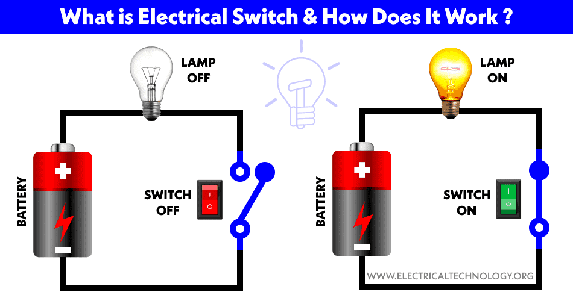]()
  - Add visual Feedback - Light on or off (1 or 0)
    - Even though the light has in reality many, many different states constantly
     changing over time, we can still use it to represent a single state at time: Either on or off.
    - In this way, we can use the light to represent a "bit" of information, which is the most basic unit of information in computing.

    - Simple switches can be used to represent two boolean logic operations: AND and OR
      - Two switches in series represent a Logical AND gate
      - Two switches in parallel represent a Logical OR gate
  - These operations are called "gates," conceptually similar to someone following a path across a fence, you can only
    pass through a gate if it's open, and you can't pass through if it's closed.

  - ### Logical Operations & Boolean Arithmetic
      - true = 1 = on = connected
      - false = 0 = off = not connected
      - A Logical "1" and "0" are called a "bit," as in a "binary digit"
      - Two switches in series represent a Logical AND gate
          - `AND` is the `&&` symbol in most programming languages.
        ```Console
          Truth Table of AND gate
          | A | B | A && B |
          |---|---|--------|
          | 0 | 0 |   0    |
          | 0 | 1 |   0    |
          | 1 | 0 |   0    |
          | 1 | 1 |   1    |
          ```
      - Two switches in parallel represent a Logical OR gate
          - `OR` is the `||` symbol in most programming languages.
        ```Console
          Truth Table of OR gate
          | A | B | A || B |
          |---|---|--------|
          | 0 | 0 |   0    |
          | 0 | 1 |   1    |
          | 1 | 0 |   1    |
          | 1 | 1 |   1    |
          ```

        > - Insight 1: Logic in Physical Form
        >   - https://www.youtube.com/watch?v=txH3K3shIWs
        > - Exploring How Computers Work
        >   - https://www.youtube.com/watch?v=QZwneRb-zqA

  - ## _Boolean logic requires one more operation to be complete: The logical `NOT` operation..._
    - We need some kind of switch to represent a Logical NOT gate to create any other Boolean logic operation.
        - We need a `NOT` is the `!` symbol in most programming languages.
      ```Console
        Truth Table of NOT gate  <-- WE GOTTA HAVE SOME WAY TO DO THIS, and regular switches won't work.
        | A | !A |
        |---|----|
        | 0 |  1 |
        | 1 |  0 |
        ```
    - ### We need the light bulb to on when the switch is off, and off when the switch is on, BUT HOW TO DO THAT?

## The Magnificent Electromagnet — 1825 to present <a name="the-magnificent-electromagnet"></a>
###### the-magnificent-electromagnet
   - ### BIG IDEA — An electrical current can cause mechanical actions with certain metallic materials.
     1) To physically manipulate the physical world, like a motor or a solenoid.
     2) To induce a magnetic field to represent a "state," like magnetic tape or a hard drive.
   
     [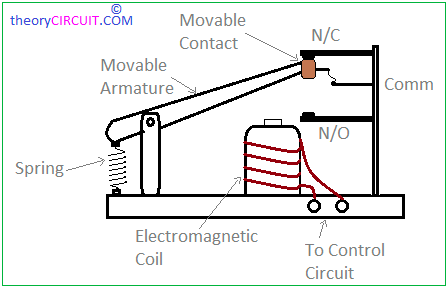](https://en.wikipedia.org/wiki/Electromagnet)
     [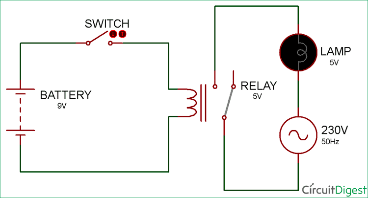](https://circuitdigest.com/electronic-circuits/simple-relay-switch-circuit-diagram)

   - Metallic materials can be made to move objects by using electricity to induce a magnetic field.
   - Additionally, certain metallic materials can be "magnetized" and "polarized" using electricity to represent a "state"
       - Magnetized or not (1 or 0)
       - North or South (1 or 0)
       - It's magnificent because it is so useful and versatile and used all over computing.
     > - How To Make an Electromagnet
     >   - https://youtu.be/Vpb7IQ2Ib_Y
     > - Magnetic Viewing Film — How it Works/Demos
     >   - https://www.youtube.com/watch?v=slVL5nbTXd4
     > - HOW MAGNETS PRODUCE ELECTRICITY
     >   - https://www.youtube.com/watch?v=FehUCQKKRwo
     > - Electronics Magnetic Cores I Properties 1961 US Army Training Film
     >   - https://www.youtube.com/watch?v=fQhSqoNm-qE
     > Magnetic Core Memory
     >   - https://www.youtube.com/watch?v=paQ3zIsz1-8

## The Raucous Relay — 1835 to 1920's <a name="the-raucous-relay"></a>
###### the-raucous-relay
   - ### BIG IDEA — Use an electromagnet to control a switch (or multiple switches.)
   
   - The first electrical computers were made of relays (extremely slow but faster than calculating manually!)
   - If a relay is set up to turn a switch OFF when the electromagnet is electrified, this creates a logical NOT gate,
     so using a relay in this way allows us to represent any other logic gate!
   - `NOT` is the `!` symbol in most programming languages.
       ```Console
         Truth Table of NOT gate
         | A | !A |
         |---|----|
         | 0 |  1 |
         | 1 |  0 |
 
   - Logical NOT is also called "inversion" or "negation" in Boolean logic, or "inverted state"
   - It's raucous because it makes a lot of noise when it switches on and off
 
     > - AND OR NOT gates with Relays
     >   - https://www.youtube.com/watch?v=FKub2SuugsQ
     > - Computers built using Relays
     >   - https://youtu.be/e8DavnWmr1E
     >   - https://youtu.be/NXeBR-lbnjI
     > - Relay Memory Circuit
     >   - https://www.youtube.com/watch?v=UEzirsIhFp4
     > - Hexadecimal Relay Calculator
     >   - https://www.youtube.com/watch?v=OzTwg-AQJ6E
     > - Relay Calculators: Episode 3 - Relay Logic Gates, Latches and Delays
     >   - https://www.youtube.com/watch?v=_nXc439NTYk
     > - Relay Calculators: Episode 4 - Mistakes
     >   - https://youtu.be/OZXwNiJ7mtw

## The Voracious Vacuum Tube — 1904 to 1960's <a name="the-voracious-vacuum-tube"></a>
###### the-voracious-vacuum-tube
   - ### BIG IDEA — Instead of using a magnetic field to control a switch, we can use a vacuum to control the flow of electricity, in a way that works just like a switch.

     [](https://en.wikipedia.org/wiki/Vacuum_tube)
     [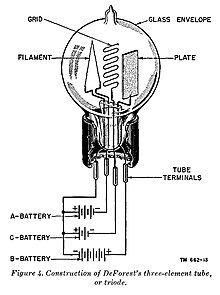](https://en.wikipedia.org/wiki/Vacuum_tube)
   
     > - How Vacuum Tubes Work
     >   - https://www.youtube.com/watch?v=nA_tgIygvNo
     
     > ### Notice:  
     > While the actual physical electron flow direction is from the "negative" terminal to the "positive" terminal, the "conventional" flow direction of electricity in schematics is considered to go from the "positive" terminal to the "negative" terminal.
     >> _Yes!_  This is rather confusing at first, and you can give thanks to ding-dong Ben Franklin for this bit of technical debt we all have to deal with at the beginning of learning electronics.
   
   - Electricity in a vacuum behaves differently than in normal atmosphere.
       - Electrons can flow freely in a vacuum. I like to think of this as the invention of "nothing."
       - Tubes exploit this behavior of electrons in a vacuum to perform like a switch or an amplifiers.
   - The Tube made for use in logic (Triode) consists of three parts:
       - **"Cathode"**
           - Essentially a light bulb filament tied to the common "ground/negative" terminal of the power supply.
           - The Negative terminal of the tube is used to "emit" electrons to the anode and complete the circuit.
       - **"Anode"**
           - Positive terminal of the tube hooked to the "load" and the positive terminal of the power supply.
           - Used to "collect" electrons from the cathode and to indicate "state" and complete the circuit.
       - **"Grid"**
           - this acts as a switch also called a "valve" when referring to tubes.
   - The Grid can be used to control the flow of electricity between the cathode and anode.
       - ie: when the grid is positively charged, the flow of electricity from cathode to the anode is allowed.
       - ie: when the grid is negatively charged, the flow of electricity from cathode to the anode is deterred.
       - This acts by default like a logical "NOT" gate.
   - The tube can be used to represent any other logic gate.

     > - In a Minute: Vacuum Tube Diodes in 60 Seconds
     >   - https://www.youtube.com/watch?v=8so4qQcOAvQ
     > 1942 ARMY RADIO TRAINING FILM “ELECTRON THEORY AND THE DIODE TUBE” VACUUM TUBE ELECTRONICS
     >   - https://www.youtube.com/watch?v=cIvjBKMX9jg
     > - In a Minute: Vacuum Tube Triodes in 60 Seconds
     >   - https://www.youtube.com/watch?v=frZ35Y48vSk
     > - Let’s Build Some Logic Gates out of Vacuum Tubes: OR, NOR, NAND, AND
     >   - https://www.youtube.com/watch?v=NkmrMdigB-8
     > - Computer History 1949 -1960 Early Vacuum Tube Computers Overview
     >   - https://www.youtube.com/watch?v=WnNm_uJYWhA 
   - #### The vacuum tube is voracious because it consumes a lot of power to heat the cathode and generates a lot of excess heat.

## The Tiny Transistor - 1957 to present <a name="the-tiny-transistor"></a>
###### the-tiny-transistor
   - ### BIG IDEA — Instead of using an electrically heated wire and vacuum to control the flow of electricity, we can use an economical semiconductor material and reduce energy and size by a factor of 100.
   
     [](https://www.youtube.com/watch?v=DXvAlwMAxiA)
   
     Very similar behavior to the vacuum tube, but much, much smaller and much, much faster at switching on and off.
     > - How a Transistor Works
     >   - https://www.youtube.com/watch?v=DXvAlwMAxiA
     > - Why It Was Almost Impossible to Make the Blue LED
     >   - Excellent animation of physical electrical flow through semiconductors and how LEDs are made.
     >   - https://www.youtube.com/watch?v=AF8d72mA41M&t=203
     > - 1959 Navy Training Film - Transistors / Switching
     >   - https://www.youtube.com/watch?v=l50XdZwtQ2U
     > - Vacuum Tubes: Episode 2 — The Triode (Part 1)
     >   - Difference in behavior between Tubes and Transistors.
     >   - https://www.youtube.com/watch?v=xurmZWLjW2g

   - The Transistor consists of three parts:
       - **"Drain"**
           - (the "anode" in the vacuum tube.)
           - also known as "collector" or "sink" often connected to "load."
           - (not always "positive" in modern transistors, but usually is.)
       - **"Source"**
           - (the "cathode" in the vacuum tube)
           - also known as "emitter" often connected to "ground."
           - (not always "negative" in modern transistors, but usually is.)
       - **"Gate"** (the "Grid" in the vacuum tube.)
           - also known as "base" often connected to the "control."
           - (not always "positive" in modern transistors, but usually is.)
   - The transistor can be used to represent any other logic gate and is the current basis for all modern computing.
   - The transistor is tiny because it is much smaller when compared to a vacuum tube. 
   - It can also switch much faster and consume much less power than the vacuum tube.
   - The switching and size limits bumping up against the limits of physics on size and speed.
     small it can be made.

   - ### How to Build Complex Logic Gates from Simple Transistors
     > - How do computers remember?
     >   - https://www.youtube.com/watch?v=I0-izyq6q5s

       - Transistors can create sophisticated operations by combining them in clever ways
         > - Designing a 7-segment hex decoder
         >   - https://www.youtube.com/watch?v=7zffjsXqATg
         > - Transistor Clock
         >   - https://www.youtube.com/watch?v=Iu-W7LpSDmk

       - How do the essentials work?
         > - Using a transistor to solve our problem — How transistors work as a switch
         >   - https://www.youtube.com/watch?v=ks_VShSgPns
         > - Insight 2: The MOS Transistor
         >   - https://www.youtube.com/watch?v=sshPV7BV0k0
         > - Inverting the signal with a transistor (The `NOT` gate)
         >   - https://www.youtube.com/watch?v=hYN8C769k8A
         > - Making logic gates from transistors
         >   - https://www.youtube.com/watch?v=sTu3LwpF6XI
         > - How does memory work?
         >   - SR Latch
         >   - https://youtu.be/KM0DdEaY5sY

## The Interchangeable Integrated Chip (IC) — 1960's to present <a name="the-interchangeable-integrated-chip-ic"></a>
###### the-interchangeable-integrated-chip-ic
  - ### BIG IDEA — We can use photographic techniques to create thousands of transistors on a single chip and radically reduce the costs of manufacture and assembly of computing devices and increase functionality and reliability.
  
  - This allows creating large groups of transistor logic gates packaged together to perform a specific task.
  - The packages were standardized, allowing for the creation of complex computing devices using interchangeable parts.
  
  - #### The Logic Gate "Package"
    - A Package is a group of transistors for a specific logic operation placed on a single chip contained in a plastic
      or ceramic enclosure with metal pins to connect to the rest of the computer.
        - Basic functions consist of Logical OR, AND, NOT, NAND package (usually 2–4 gates in the same package)
        - Extremely complex functions are made by combining many of these packages in clever ways
        > - “MY FIRST CHIP” - Carver Mead - 2017
        >   - https://www.youtube.com/watch?v=F5P5SAlEbo4
        > - Intel: The Making of a Chip with 22nm/3D Transistors | Intel
        >   - https://www.youtube.com/watch?v=d9SWNLZvA8g

    > - Robert Noyce, inventor of the first monolithic IC holding a photographic layer for an Integrated Circuit.
    > 
    >   [](https://en.wikipedia.org/wiki/Robert_Noyce)
    > 
    > - Logic Gate Symbols
    >  
    >   [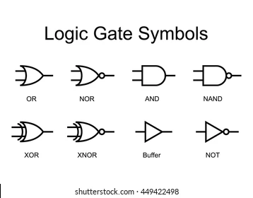](https://en.wikipedia.org/wiki/Logic_gate)
    > 
    > - Typical Early Logic Gate Package - 74HC42 (BCD to Decimal Decoder)
    > 
    >   [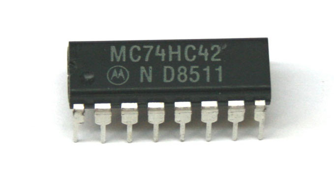](https://shop.griederbauteile.ch/en/info/7/74HC42.pdf)
    > 
    > - Package Schematic for a Quad 2-Input NAND Gate IC (74HC00)
    >   
    >   [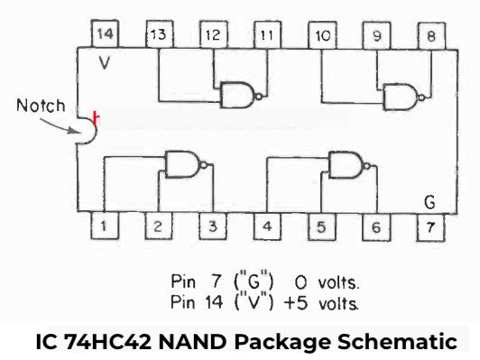](https://www.homemade-circuits.com/simple-circuits-using-ic-7400-nand-gates/)
    >   
    > - Close up of silicon wafer wired to package
    > 
    >   [](https://en.wikipedia.org/wiki/Robert_Noyce)
    > 
    > - Inverter Gate and NAND gate under 50x microscope
    > 
    >   [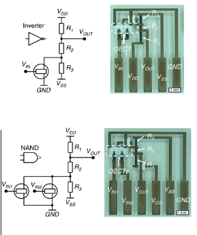](https://www.researchgate.net/figure/Logic-gates-based-on-printed-electrochemical-transistors-Schematics-of-an-inverter-a_fig3_337084817)
    > 
    > - 7-Segment LED Display Package
    > 
    >   [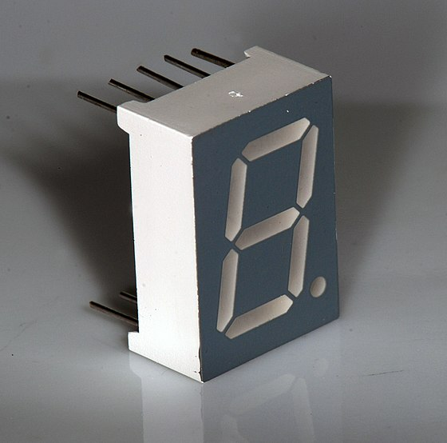](https://en.wikipedia.org/wiki/Seven-segment_display)
    > 
    > - 7-Segment Display Schematic Common Cathode
    > 
    >   [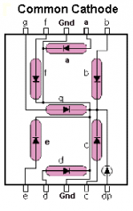]()
    > 
    > - What is a "BCD (Binary Coded Decimal) to 7 Segment Display Decoder"?
    > 
    >   [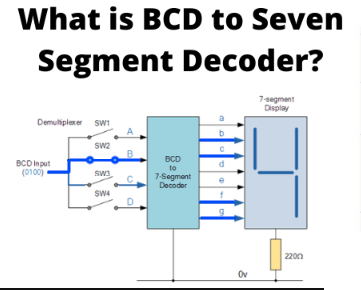](https://www.electrical4u.com/bcd-to-seven-segment-decoder/)
    > 
    > - 7-Segment Display truth table
    > 
    >   [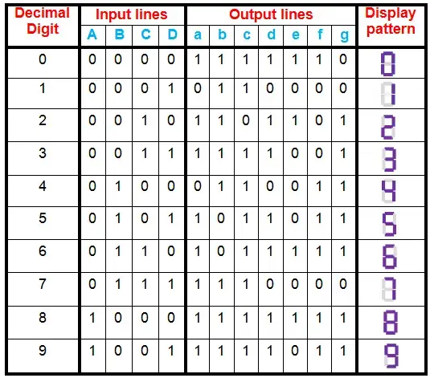](https://en.wikipedia.org/wiki/Seven-segment_display)
    > 
    > - 7-Segment Display "BCD to 7-Segment Decoder" Schematic "Naive" Implementation
    > 
    >   [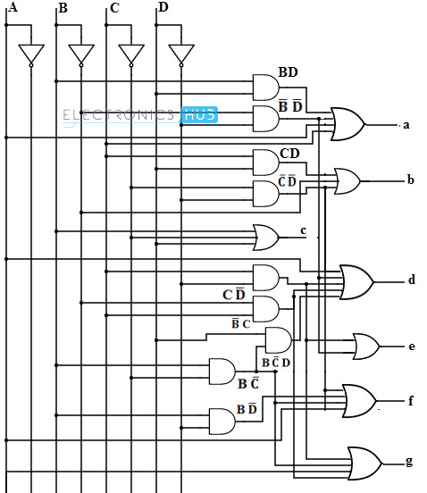](https://www.electronicshub.org/bcd-7-segment-led-display-decoder-circuit/)
    > 
    > - Schematic of BCD to Decimal Decoder using Clever Arrangement of NAND gates and Inverters
    > 
    >   [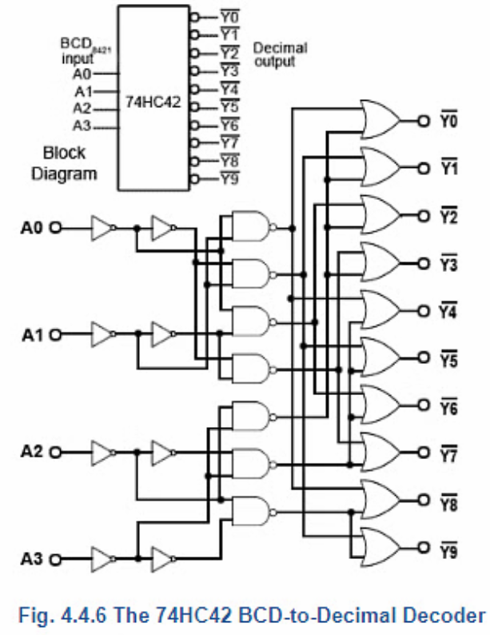](https://www.researchgate.net/figure/Binary-coded-decimal-4-to-7-decoder-a-Schematics-of-a-4-to-7-decoder-implemented-with_fig4_337084817)
    > 
    >   > - Visualizing Data with 7-Segment Displays
    >   >   - https://www.youtube.com/watch?v=hEDQpqhY2MA

  - ### Why are NAND gates special?
    - ###### nand-gates
    - ### BIG IDEA - NAND gates are known as universal gates, because you can make any other gates out of them. 
     
      [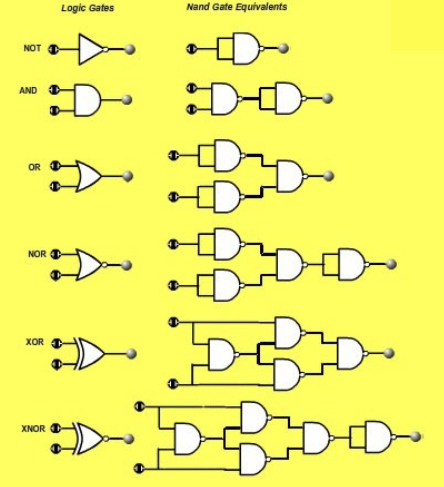](assets/NAND_equivalent.png)
      [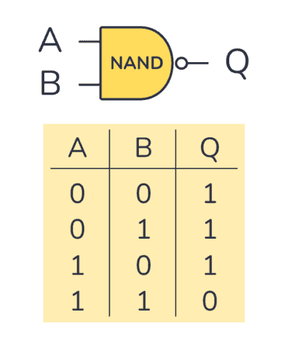](https://en.wikipedia.org/wiki/NAND_gate)
    
    - It's the most flexible gate and can be combined to create any other logic gate, ie: `AND`, `OR`, `NOT`, `XOR`, etc.
      - `NOT` (inverter) = tie the `NAND` inputs together, this applies the same input to the 2 NAND’s inputs. 
      - `AND` = `NAND` gate accepts 2 inputs and placing a `NOT` gate on the `NAND` output makes an `AND` gate.
      - `OR` = Inverters on each of the `NAND` gate inputs makes an `OR` gate.
      - `NOR` = Take one NAND gate, and place 2 inverters on each of the 2 NAND gate inputs and an inverter on the NAND output, makes a `NOR` gate.
      - `XOR` = 4 NAND gates makes an "exclusive OR"`XOR` gate.
      - `XNOR` = 4 NAND gates + one NAND inverter makes an "exclusive NOR" `XNOR` gate.
    - Everything in computers can be accomplished solely with just these three types of gates.
    - Most early semiconductor-based digital electronic calculators were made up of many IC's consisting solely of these NAND gates.

    - From simple NAND gate packages to a somewhat sophisticated 7-segment display using LED's.
      > - Designing a 7-segment hex decoder
      >   - https://www.youtube.com/watch?v=7zffjsXqATg

## The Mighty Microprocessor — 1971 to present <a name="the-mighty-microprocessor"></a>
###### the-mighty-microprocessor
  - ### BIG IDEA — Consolidate all the necessary components from various Integrated Chips required for a computer onto a single chip.
  
    [](https://en.wikipedia.org/wiki/MOS_Technology_6502)

  - Simply groups of different Integrated Chips ➜ All put on one chip.
  - Contains a CPU (Central Processing Unit) and a small amount of ultra-fast memory (called "Registers").
  - The CPU is just a clever and somewhat complex arrangement of logic gates that can perform a series of logical operations/
    > - An intuitive approach for understanding the CPU and RAM
    >   - https://www.youtube.com/watch?v=-IyB8hBkA9w
    > - How a CPU Works
    >   - https://www.youtube.com/watch?v=cNN_tTXABUA

  - Each part of the CPU is made of millions of the same kinds of logic gates that we've already discussed.
  - The CPU has a "clock" to synchronize the operations of the CPU.
  - It also has a "program counter" to keep track of the current instruction in memory that the CPU is executing.
  - Has an "ALU" (Arithmetic Logic Unit) to perform basic arithmetic and logical operations.
      > - How does an ALU work?
      > - Learn how computers add numbers and build a 4-bit adder circuit
      >   - https://youtu.be/wvJc9CZcvBc
  - It May contain a small amount of "cache" memory (extremely quick memory near the CPU circuits) to speed up access to the main memory.
  - CPUs are where the execution of each instruction happens.

## The Configurable Computer <a name="the-configurable-computer"></a>
###### the-configurable-computer
  - ### BIG IDEA — Instead of putting all the functions for a task into a single computer, define for a standardized interface to connect different devices to perform a task.  
    
  - By arranging the basic electronic components in particular patterns to achieve a specific narrow specialized task,
    like storing data on some medium, measuring sensors, controlling a motor, displaying an image, etc.
    
    > - Digital Computer Techniques: Programming (1962) - AT&T Archives
    >   - https://www.youtube.com/watch?v=dFZecokdHLo
    > - Digital Computer Techniques: Computer Units (1962) - AT&T Archives
    >   - https://www.youtube.com/watch?v=5d7EMsy_RC0

  - Bus (a set of wires that connect the CPU to the rest of the computer)
    > - Experimenting with Buses and Three-State Logic
    >   - https://www.youtube.com/watch?v=_3cNcmli6xQ

  - ROM (Read-Only Memory)
    - Used to hold the basic software to start ("boot") the computer (sometimes called "firmware")
    - The values of each memory location are programmed, or "burned" into the ROM and usually cannot be changed.
    - Most ROMs cannot be changed
    - Some changed only once like PROMs (Programmable Read-Only Memory)
    - Some can be changed many times like EPROMs (Erasable Programmable Read-Only Memory) but
      these changes are slow and require special equipment. There is a limit to the number of times they can be changed.
      
      [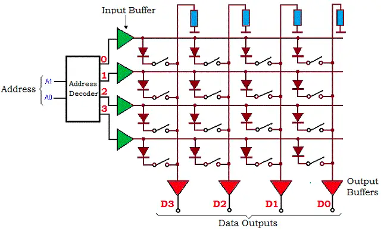](https://en.wikipedia.org/wiki/Read-only_memory)

  - RAM (Random Access Memory)
    > - RAM module build - part 1
    >   - https://www.youtube.com/watch?v=uYXwCBo40iA
    > - RAM - Random Access Memory - How does a RAM of PC store data?- Video IT
    >   - https://www.youtube.com/watch?v=Kav6oOFDQSA
    > - Dynamic Random Access Memory (DRAM). Part 1: Memory Cell Arrays
    >   - https://www.youtube.com/watch?v=I-9XWtdW_Co

  - I/O (Input/Output) & Peripherals & Removable Storage & More
    - All just more variations of the same thing.
        - All built up from the same basic logic gates and transistors, or similar technology.
        - Even video cameras, microphones, radios and speakers are just variations of the same basic technology.
    - Using the same principles to represent logic states and perform logical operations.
    - Often electromagnets are used to control mechanical devices or other machines.
      - The classic example is the "hard drive" which uses a spinning disk and a moving arm to read and write data.
      - The "hard drive" is a "magnetic" storage device, and uses tiny spots of "magnetized" material to represent the "state" of the data.
      - The arm is controlled by software and uses "magnets" to move the arm to the correct position to read and write the data.
      - Some sort of electrified magnet is the usual way that computers interact physically with the world.

    > - DATA PROCESSING AN INTRODUCTION 1972 KEY PUNCH COMPUTER & MAGNETIC TAPE EDUCATIONAL FILM
    >   - https://www.youtube.com/watch?v=uOYJtnux2sA
    > - Communications Milestone: Charged Coupled Devices (with Bonus Edition Introduction) — AT&T
    >   - https://youtu.be/MoqeMEsC5p0?si=iizZq8ZJGxSEh16P&t=206
    >> Note that the CCD was invented in an "hour" due to how many other technologies had to be invented first.

  - Putting it all together
    > - 1969 EDUTRONICS COMPUTER DATA PROCESSING PRINCIPLES & FILE CONCEPTS 54124
    >   - https://www.youtube.com/watch?v=0bLQ9EQ6PdY
    > - 1970s COMPUTER DATA PROCESSING & FILE MAINTENANCE EDUCATIONAL FILM FLOWCHARTS
    >   - https://www.youtube.com/watch?v=geo8UtItSwU

- [Continue Reading - Data Structures](./04-DataStructures.md)
- [Back to Index](README.md)
