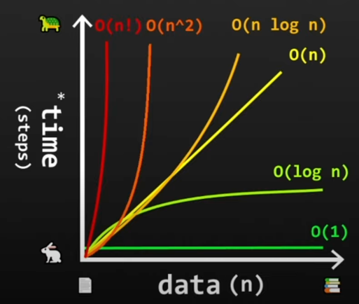

# Software Design

  - ### BIG IDEA — How do we talk about these things with other people efficiently and effectively?

## Algorithms - How are we gonna solve this? <a name="algorithms"></a>
  - ### BiG IDEA - Let's give names to the clever ways we humans have found to solve problems.

  - Algorithms are just a set of instructions that are used to solve a problem or perform a task, all based on the
    cleverness and creativity of the designer. People have invented many ways to solve problems, and some of these
    are so common that they have been given names, like "sorting" and "searching" algorithms.
    > - Binary Search Algorithm - Code walk-through and Complexity Analysis
    > - https://www.youtube.com/watch?v=LdjkZ2vQapI
    > - Animated Interactive Visualizations with pseudocode for many common data structures
    > - https://www.cs.usfca.edu/~galles/visualization/Algorithms.html

    > Quick Sort [Visual Explanation] 
    >   - https://www.youtube.com/watch?v=WprjBK0p6rw
   
    > 15 Sorting Algorithms in 6 Minutes
    >   - https://www.youtube.com/watch?v=kPRA0W1kECg
    
    > Sorting Algorithms Explained Visually
    >   - https://www.youtube.com/watch?v=RfXt_qHDEPw

## Time Complexity - How long is this gonna take? <a name="time-complexity"></a>
  - ### BiG IDEA — Let's have a standard way to communicate about how long an algorithm or program will take to execute.
  
  - The "time complexity" of a program is a measure of how the "running time" of the program grows as the "input size"
    of the program grows.
  - Also known as "Algorithmic Complexity" or "Big O notation"
  - The "time complexity" is usually expressed as a "big O" notation, which is a way to express the "upper bound" of
    the "running time" of the program, ie: the worst case scenario.
  - The "big O" notation is a way to express the "upper bound" or maximum expected of the worst-case running time of a program.
  - 6 Common Types of Time Complexity:
      - O(1) - "Constant Time" - The running time of the program does not change as the input size of the program grows.
      - O(n) - "Linear Time" - The running time of the program grows as the input size of the program.
      - O(n^2) - "Quadratic Time" - The running time of the program grows as the square of the input size of the program.
      - O(n^3) - "Cubic Time" - The running time of the program grows as the cube of the input size of the program.
      - O(log n) - "Logarithmic Time" - The running time of the program grows as the logarithm of the input size of the program.
      - O(n log n) - "Linearithmic Time" - The running time of the program grows as the product of the input size of the program and the logarithm of the input size of the program.
        
        [](https://www.youtube.com/watch?v=XMUe3zFhM5c)
    
        > - Learn Big O notation in 6 minutes 📈
        >   - https://www.youtube.com/watch?v=XMUe3zFhM5c
  
  - ### Shorthand Guide & Sample Code <a name="time-complexity-example"></a>
    - If you are doing a simple lookup in an array, it's O(1) because the time it takes to find the value in the array
      does not change as the size of the array grows.
    - If you are looping over items, it's O(n) because the time it takes to loop over the items grows as the size of the
      array grows.
    - If you are looping over items that are also looping over items, it's O(n^2) because the time it takes to loop over
      the items grows as the square of the size of the array grows.
    - Each time you add another loop, the time complexity grows as the square of the size of the array grows.
    - If you are doing a binary search, and each time you search you are cutting the size of the array in half,
      it's O(log n)
 
    - ```Kotlin
      // Program to illustrate the time complexity of various operations
      
      // Algorithm: Binary Search
      // Perform binary search a sorted array - O(log n)
      // Returns the index of the value in the array, or -1 if the value is not found.
      fun Array<Int>.binarySearch(value: Int): Int {
          var low = 0
          var high = size - 1
          while (low <= high) {
              val mid = (low + high) / 2  // search 1/2 of the array each loop
              val midVal = this[mid]
              when {
                  midVal < value -> low = mid + 1
                  midVal > value -> high = mid - 1
                  else -> return mid
              }
          }
          
          return -1 // -1 = value not found
      }
      
      // Algorithm: Quick Sort
      // Perform recursive quicksort - O(n log n)
      // Returns a new sorted array.
      fun Array<Int>.quickSort(): Array<Int> {
          if (size < 2) return this
          val pivot = this[randomInt(size - 1)]
          
          val less = filter { it < pivot }.toTypedArray().quickSort()
          val equal = filter { it == pivot }.toTypedArray()
          val greater = filter { it > pivot }.toTypedArray().quickSort()
          
          return less + equal + greater
      }
      
    
      fun main() {
         val x: Array<Int> = Array(100) { randomInt(100) } // <-- O(n) - Fill Array x with 100 random integers
         
         val a: Int = x[50] // <-- O(1) - Simple Lookup
         
         for (i in 0 until x.size) { // <-- O(n) - Loop over items 1 time
             println(x[i])
         }
         
         for (i in 0 until x.size) { // <-- O(n) 
             for (j in 0 until x.size) { // <-- O(n^2) - Double Loop over items (squared)
                 println(x[i] + x[j])
             }
         }
         
         // Notice this one will take MUCH, MUCH longer than the previous ones.
         for (i in 0 until x.size) { // <-- O(n)
             for (j in 0 until x.size) { // <-- O(n^2)
                 for (k in 0 until x.size) { // <-- O(n^3) - Triple Loop over items (cubed)
                     println(x[i] + x[j] + x[k])
                 }
             }
         }
         
         val sorted: Array<Int> = x.quickSort() // <-- O(n log n) - Fastest known sorting algorithm for general case.
         val y = sorted.binarySearch(50) // <-- O(log n) - Searches a sorted array for a value, halving the search space each loop.
      }
      
      // << NO OUTPUT - Just code illustrating the time complexity of the operations >> 
      // << - Run the live code example to generate output >>
      ```
        > Live Code Example: [Time Complexity Example](src/main/kotlin/timeComplexityExample.kt)

## Communicating Software Designs Visually <a name="communicating-software-designs"></a>
  - ### Big IDEA — How can we use diagrams and drawings to communicate about software designs? 
  
  - ### The Line, The Box and The Layers
    - At the time when structured programming became popular, the concept of "Software Design" was developed to help
      people create more complex software systems with more complex requirements and coordinating work with larger 
      teams of people working together in the same codebase.
    > - Software Design: Ep2 : 2nd Law of Software Design
    >     - https://www.youtube.com/watch?v=fh1a74WWvJQ
    > - Software Design: Ep3 : Conceptual Layers
    >     - https://www.youtube.com/watch?v=8R7hoC3OuPo
    > - Software Design: Ep4 : 3rd Law of Software Design
    >     - https://www.youtube.com/watch?v=nCxhJ_51fjA 

- [Continue Reading - Class Oriented Programming](./09-ClassOrientedProgramming.md)
- [Back to Index](README.md)