# Functional Programming (FP) 1950s-Present <a name="FunctionalProgramming"></a>
###### functional-programming
  - ### BIG IDEA - Shared mutable state is a complex problem, especially for parallel processing tasks. 

    > [](assets/functional-chart-updated.png)

  - ### The Functional style requires:
    1) Calling functions will NEVER change anything outside the function being called.
       - ie: "pure functions," 
       - "no side effects", 
       - "side-effect free,"
       - "no shared mutable state."
    
       - ### All these phrases mean "A 'function' that doesn't change anything outside of it's scope."
    
       - _They don't seem to count the "program counter" or "stack pointer" as "state" though..._
       - They mean the "state" of the program's data, not necessarily the "state" of the program's execution.
       ####
    
    2) Functions passed in with the same values will ALWAYS return the same value as a result.
       - ie: "deterministic", 
       - "referentially transparent", 
       - "idempotent," 
       - "stateless," 
       - "pure,"
       - "no shared mutable state."
         
       - ### All these phrases mean "A 'function' that doesn't change anything outside of it's scope."
    
    3) Functions can be passed as arguments to other functions.
       - ie: "higher-order functions", 
       - "lambdas", 
       - "closures",
       - "first-class citizen functions", 
       - "anonymous functions", 
       - "function literals."
         
       - ### All these mean "functions."
       
    - ## ⚠️ EXCESSIVE WORD-INVENTIONS FOR THE SAME DEFINITION!!!
      > SEE WHAT I MEAN WITH ALL THE NAMES FOR THE SAME THING? 😐🤪🤨😳😒?
        ### 🛑 ATTENTION COMPUTER SCIENCE PEOPLE:
        ### 🤨 Please stop with all the names for the same exact stuff!!!!! I know you gotta make sales, but come on!
        
        > _YOU MAY HAVE A MEDICAL CONDITION:_
        > - **_"Sesquipedalianism"_** refers to the tendency to use long words or create unnecessarily complex words when simpler ones would suffice, often resulting in verbose or convoluted language. It can also describe the habit of inventing new words or phrases for concepts that already have well-established terms. 
        > - _This behavior is often seen as pretentious or pedantic._ 
  
## Immutability & No Side Effects <a name="immutability-no-side-effects"></a>
###### immutability-no-side-effects
  - Mutability means something can be changed, and immutability means it cannot be changed once it's created.
    - Functional Programming style's main idea is to avoid "side effects" and "shared mutable state" of the program.
    - One way is to is to make the state of the program read-only. 
    - Changes can only be made by calling a function to create a new state based on the a copy of the old state, 
      and then returning the new program state as the result.
    - The BOOP ("Back-to Object Oriented Programming") style is a form of Functional Programming as the state of the 
      program is immutable and passed as arguments.
      to the functions, and a new state is returned as the result of the calls to the functions.
      > [](assets/functional-programming.png)

- It's more of a style of programming than a paradigm as it can be used in any language, but it's most effective
  in languages that are designed to be functional from the ground up.
- New states of the program can be created by passing in the state of the program as arguments to program functions,
  and a new state is returned as the result of the calls to the functions.
- This makes the program easier to understand and maintain, and allows for parallel ("concurrent") programming
  to be done far more easily.
  
  > ### ❤️😍💓 _Immutability eliminates whole classes of bugs that are caused by side effects that plague COP-style programs._
  >
  > #### Remember the banking example from the Procedural Programming section?
  > - Where the bank computer manager talks about only making copies of the data and not changing the original data?
  > - https://youtu.be/fAselhq0Q8g?si=3t_GnlWiybu3Bvg6&t=1032

- Functions are "first-class citizens" and can be passed as arguments to other functions, just like normal variables and objects
    - This allows customization of functions by passing in another function as an argument to be used in processing.
    - This allows the functions to be "composed" together to create new functions from existing functions
    - These functions are called "lambdas," "closures," "anonymous functions" or "function literals,"
      and "higher-order functions" all interchangeably. 
    - It's all just functions!
- Examples of functional languages are "Lisp", "Clojure" and "Javascript" and "Kotlin"

### Code Example demonstrating Side Effects (Kotlin):
###### sideEffectsExample
  ```Kotlin
  // Kotlin code to demonstrate side effects, pedantically.
  fun main() {
     var x = 0 // <-- Defines a variable that will be "affected" or "mutated" by the lambda.
     val add = { a: Int, b: Int -> // <-- Defines a lambda that takes two Ints and returns an Int.
        val result =  a + b + x
        x += a  // <-- Create a "side effect" by changing the value of `x` outside the lambda.
     
        result // <-- Return the result of the addition including the side effect.
     }
     
     println(add(1, 2))  // <-- Print expected value the first time called (3).
     
     println(add(1, 2))  // <-- Print the unexpected value the second time called (4) due to the side effect.
  }
  
  // Output:
  // 3   // <-- This value of is what we expected, only the first time though...
  // 4   // <-- This value of is not what we expected due to the side effect.
  

  ```
  > Live Code Example: [Side Effects Example](src/main/kotlin/sideEffectsExample.kt)

### Code Example of Functional style (Kotlin):
###### functionalExample
  ```Kotlin
  fun main() {
     val addFunc = { x: Int, y: Int -> x + y }  // <-- Defines a lambda that takes 2 integers and returns the sum of the integers.
     val multiplyFunc = { x: Int, y: Int -> x * y }  // <-- Defines a lambda that takes 2 integers and returns the product of the integers.
     val firstThenSecond = {  // <-- Defines a lambda that takes 4 arguments, 2 functions and 2 integers, and returns the result of the 2 functions. 
         first: (Int, Int) -> Int, // <-- 🟡 Accepts a lambda that takes 2 integers and returns an integer, it's executed first.
         second: (Int, Int) -> Int,  // <-- 🔴 Accepts a lambda that takes 2 integers and returns an integer, it's executed second.
         a: Int, b: Int -> 
            second(first(a, b), b)  // <-- Calls the `first` lambda with the 2 integers (a & b), 
                                    //     then calls the `second` lambda with the result of `first()` and the 2nd integer (b)
     }              
     
     val result = firstThenSecond(addFunc, multiplyFunc, 10, 2) // <-- 🟠 calls the lambda with the 2 functions and 2 integers 
                                                        //     using the "first class citizen" variables that each 
                                                        //     contain a function as a value (also called a lambda.)
     println(result) // result will be 24
     
     val resultUsingAnonymousFunctions = 
        firstThenSecond(  // <-- Calls the `firstThenSecond` lambda with the 2 "anonymous functions" and 2 integers.
           { a, b -> a + b },  // <-- Defines an "anonymous function" that takes 2 integers and returns the sum of the integers.
           { a, b -> a * b },  // <-- Defines an "anonymous function" that takes 2 integers and returns the product of the integers.
           10, 2
        )
     println(resultUsingAnonymousFunctions) // result will be 24 
  }
  
  main()
    
  // Output:Add 
  // 24
  // 24
  ```
  > Live Code Example: [Functional Example](src/main/kotlin/functionalExample.kt)

```mermaid
flowchart TB

note["The function call chain 
for the Functional Example program."]

start((("🟠 1. Start here"))) ==> Z

X[" `first` points to `add` function "] ==>|"🟡 3. Calls function with x= 10, y= 2"| addFn{{" 
   func add(…) @F8BC76FC =
   ✚ { x,y -> return x+y } 
   ⌺"}}
Y[" `second` points to `multiplyFunc`"] ==>|"🔴 5. Calls function with x=12, y=2"| multiplyFn{{" 
   func multiply(…) @48C6CE7B = 
   ╳ { x,y -> return x*y }
   ⌺"}}
Z["val result = firstThenSecond(addFunc, multiplyFunc, 10, 2)"] ==>|"🔵 2. Calls function with params"| firstThenSecondFunc{{" 
   func firstThenSecond(…) @A8C6CE7B =
   ⏩ { first, second, a, b -> second(first(a, b), b) }
   ⌺"}}

addFn ==>|"🔵 4. returns result ❪12❫ into `second`
          function's `a` parameter"| firstThenSecondFunc
multiplyFn ==>|"🔵 6. returns result ❪24❫"| firstThenSecondFunc
firstThenSecondFunc ==>|"🔵 7. returns result ❪24❫"| Z
firstThenSecondFunc -.-> X
firstThenSecondFunc -.-> Y

```

## Function Evaluation Sequence <a name="functional-call-chain"></a>

### How Flow of Execution Travels in the Functional Example 

```mermaid
flowchart LR
 subgraph main["func main()"]
    
   X["val `addFunc` = @F8BC76FC"] ==>|"🟠 START HERE: 1. Stores pointer to function"| addFn{{" 
      func add(…) @F8BC76FC =
      ✚ { x,y -> return x+y }
      ⌺"}}
   Y["val `multiplyFunc` = @48C6CE7B"] ==>|"🔵 2. Stores pointer to function"| multiplyFn{{" 
      func multiply(…) @48C6CE7B = 
      ╳ { x,y -> return x*y }
      ⌺"}}
   Z["val `firstThenSecond` = @A8C6CE7B"] ==>|"🔵 3. Stores pointer to function"| firstThenSecondFunc{{" 
      func firstThenSecond(…) @A8C6CE7B =
      ⏩ { first, second, a, b -> second(first(a, b), b) }
      ⌺"}}
   
   D -.->|`firstThenSecond` points to function| firstThenSecondFunc
   firstThenSecondFunc -...->|"🟡 7. Calls `first`"| addFn
   firstThenSecondFunc -...->|"🔴 9. Calls `second`"| multiplyFn
   
   subgraph result["🔵 4. val `result` = firstThenSecond(first= addFunc, second= multiplyFunc, a= 10, b= 2)"]
     resultInner["Result of firstThenSecond(…)"] ==> E
     D("Evaluate ⏩ firstThenSecond(…)_= second(first(a,b), b)") ==>|"🔵 5. Calls"| first
     subgraph firstThenSecond[" 🔵 6. firstThenSecond(…) internal calls..."]
        first("🟡 7. Calls `first`(…) = `✚ addFunc(a,b)`")==>|"🔵 8. Returns result into `second` function's `a`"| second
        second("🔴 9. Calls `second`(…) = `╳ multiplyFunc(a,b)`") ==>|"🔵 10. Returns result"| resultInner
        
        %% Show where return to firstThenSecond
        %% second("calls second(…) = `╳ multiplyFunc(a,b)`") ==>|🔵 6. returns result| D
     end
   end
   E("Stores returned result in variable `result`") ==>|"🔵 11. Variable `result` passed to"| F
   F["print(`result`)"]==>|"🔵 END 12. program ends"| G

   %% Show the function pointers for the lambda
   %%   first -..->|`first` points to function| addFn
   %%   second -...->|`second` points to function| multiplyFn
 end
 G("🖥️ main()")
 
```



# Side Quest on "Declarative" Programming
  > - Notice that many of the diagrams in this document are written in a language that uses "declarative" style programming.
  > - Mermaid is a "Domain Specific Language" (DSL) used to create the diagrams in a declarative style using only human-readable text code.
  > - This allows for more flexible and maintainable diagrams that can be created and maintained in a text file opposed to using a graphics editor.
  > - Allows to be rendered in many different formats, including SVG, PNG, and PDF, and is responsive to different screen sizes.
  > - ### I can change the diagram layout and style by changing the code, and the diagram will update automatically, avoiding the need to manually redraw the diagram in a graphics editor.
  > 
  >   - [https://mermaid.js.org/](https://mermaid.js.org/intro/)
  >> ### More on Declarative Programming:
  >> - 'Declarative Thinking, Declarative Practice' - Kevlin Henney [ ACCU 2016 ]
  >>   - https://www.youtube.com/watch?v=nrVIlhtoE3Y 
  >> - HTML IS a Programming Language (Imperative vs Declarative) - Computerphile
  >>   - https://www.youtube.com/watch?v=4A2mWqLUpzw
  >> - You Should Use Sequence Diagrams
  >>   - https://www.youtube.com/watch?v=DaP6z2CsVhM 


- [Continue Reading - Back-to-Object Oriented Programming](11-BackToObjectOrientedProgramming.md)  
- [Back to Index](README.md)