# Functional Programming 1950s-Present (FP) <a name="FunctionalProgramming"></a>
###### functional-programming
  - ### BIG IDEA - Shared mutable state is a complex problem, especially for parallel processing tasks. 

  - ### The Functional style requires:
    1) Calling functions will NEVER change anything outside the function being called. 
       - ie: "pure functions." "no side effects", "no shared mutable state."
    2) Functions passed in with certain arguments will ALWAYS return the same result.
       - ie: "deterministic", "referentially transparent", "idempotent," "stateless," "side-effect free."
    3) Functions can be passed as arguments to other functions.
       - ie: 
         - "higher-order functions", 
         - "lambdas", 
         - "closures",
         - "first-class citizen functions", 
         - "anonymous functions", 
         - "function literals."
       - ### All these mean "functions!"
       
    - ## SEE WHAT I MEAN WITH ALL THE NAMES FOR THE SAME THING?
      - ### ATTENTION COMPUTER SCIENCE PEOPLE 
      - ### Please stop with all the names for the same old stuff!!!!!   

## Immutability & No Side Effects <a name="immutability-no-side-effects"></a>
###### immutability-no-side-effects
  - Mutability means something can be changed, and immutability means it cannot be changed once it's created.
    - Functional Programming style's main idea is to avoid "side effects" and "shared mutable state" of the program.
    - One way is to is to make the state of the program unchangeable. Changes can only be made by creating a new state
      based on the a copy of the old state, and then returning the new state as the result of a function.
    - The BOOP ("Back-to Object Oriented Programming") style is a form of Functional Programming as the state of the 
      program is immutable and passed as arguments.
      to the functions, and a new state is returned as the result of the calls to the functions.
- All functions in the core of the application return a value and have no side effects on any other state of
  the program.
- It's more of a style of programming than a paradigm as it can be used in any language, but it's most effective
  in languages that are designed to be functional from the ground up.
- New states of the program can be created by passing in the state of the program as arguments to program functions,
  and a new state is returned as the result of the calls to the functions.
- This makes the program easier to understand and maintain, and allows for parallel ("concurrent") programming
  to be done far more easily.
- Immutability eliminates whole classes of bugs that are caused by side effects that plague COP-style programs.
- Functions are "first-class citizens" and can be passed as arguments to other functions, just like normal variables and objects
    - This allows customization of functions by passing in another function as an argument to be used in processing.
    - This allows the functions to be "composed" together to create new functions from existing functions
    - These functions are called "lambdas," "closures," "anonymous functions" or "function literals,"
      and "higher-order functions" all interchangeably. 
    - It's all just functions!
- Examples of functional languages are "Lisp", "Clojure" and "Javascript" and "Kotlin"

- Example with Side Effects (Kotlin):
  - ###### sideEffectsExample
  ```Kotlin
  fun main() {
     var x = 0 // <-- a variable that will be "side-effected" or "mutated" by the lambda.
     val add = { a: Int, b: Int ->
           val result =  a + b + x
           x += a  // <-- Create a "side effect" by changing the value of `x` outside the lambda.
		 
           result // <-- return the result of the addition.
        } 
  
     print(add(1, 2))  // <-- print expected value the first time called (3).
	
     println(add(1, 2))  // <-- print the unexpected value the second time called (4) due to the side effect.
  }

  // Output:
  // 3   // <-- The value of is what we expected, only the first time though.
  // 4   // <-- This value of is not what we expected.

  ```
  > Live Code Example: [Side Effects Example](src/main/kotlin/sideEffectsExample.kt)

- Example of Functional style (Kotlin):
    - ###### functionalExample
  ```Kotlin
  fun main() {
     val addFunc = { x: Int, y: Int -> x + y }  // <-- a lambda that takes 2 integers and returns the sum of the integers.
     val multiplyFunc = { x: Int, y: Int -> x * y }  // <-- a lambda that takes 2 integers and returns the product of the integers.
     val firstThenSecond = {  // <-- a lambda that takes 4 arguments, 2 functions and 2 integers, and returns the result of the 2 functions. 
         first: (Int, Int) -> Int, // <-- 🟡 a lambda that takes 2 integers and returns an integer, it's executed first.
         second: (Int, Int) -> Int,  // <-- 🔴 a lambda that takes 2 integers and returns an integer, it's executed second.
         a: Int, b: Int -> 
            second(first(a, b), b)  // <-- calls the `first` lambda with the 2 integers (a & b), 
                                    //     then calls the `second` lambda with the result of `first()` and the 2nd integer (b)
     }              
     
     val result = firstThenSecond(addFunc, multiplyFunc, 10, 2) // <-- 🟠 calls the lambda with the 2 functions and 2 integers 
                                                        //     using the "first class citizen" variables that each 
                                                        //     contain a function as a value (also called a lambda.)
     println(result) // result will be 24
     
     val resultUsingAnonymousFunctions = 
        firstThenSecond(  // <-- calls the `firstThenSecond` lambda with the 2 "anonymous functions" and 2 integers.
           { a, b -> a + b },  // <-- an "anonymous function" that takes 2 integers and returns the sum of the integers.
           { a, b -> a * b },  // <-- an "anonymous function" that takes 2 integers and returns the product of the integers.
           10, 2
        )
     println(resultUsingAnonymousFunctions) // result will be 24 
  }
  
  main()
    
  // Output:Add 
  // 24
  // 24
  ```
  > Live Code Example: [Functional Example](src/main/kotlin/functionalExample.kt)

```mermaid
flowchart TB

note["`a Directed Acyclic Graph (DAG) represents the function call chain for the example program.`"]

start((("🟠 1. Start here"))) ==> Z

X[" `first` points to `add` function "] ==>|"🟡 3. Calls function with x= 10, y= 2"| addFn{{" 
   func add(…) @F8BC76FC =
   ✚ { x,y -> return x+y } 
   ⌺"}}
Y[" `second` points to `multiplyFunc`"] ==>|"🔴 5. Calls function with x=12, y=2"| multiplyFn{{" 
   func multiply(…) @48C6CE7B = 
   ❌ { x,y -> return x*y }
   ⌺"}}
Z["val result = firstThenSecond(addFunc, multiplyFunc, 10, 2)"] ==>|"🔵 2. Calls function with params"| firstThenSecondFunc{{" 
   func firstThenSecond(…) @A8C6CE7B =
   ⏩ { first, second, a, b -> second(first(a, b), b) }
   ⌺"}}

addFn ==>|"🔵 4. returns result ❪12❫ into `second`
          function's `a` parameter"| firstThenSecondFunc
multiplyFn ==>|"🔵 6. returns result ❪24❫"| firstThenSecondFunc
firstThenSecondFunc ==>|"🔵 7. returns result ❪24❫"| Z
firstThenSecondFunc -.-> X
firstThenSecondFunc -.-> Y

```

### Function Evaluation Sequence <a name="functional-call-chain"></a>

### How Flow of Execution Travels in the Functional Example 


  > ## Side Quest on "Declarative" Programming
  > - Notice that many of the diagrams in this document are written in a language that uses pure "declarative" style programming.
  > - The charts are using a declarative language called "Mermaid" to create many kinds of diagrams using only text.
  > - This allows for more flexible and maintainable diagrams that can be created and maintained in a text file opposed to using a graphics editor.
  > - Mermaid is a "Domain Specific Language" (DSL) that is used to create diagrams in a "declarative" style.
  >   - [https://mermaid.js.org/](https://mermaid.js.org/intro/)
  >> ### More on Declarative Programming:
  >> - 'Declarative Thinking, Declarative Practice' - Kevlin Henney [ ACCU 2016 ]
  >>   - https://www.youtube.com/watch?v=nrVIlhtoE3Y 
  >> - HTML IS a Programming Language (Imperative vs Declarative) - Computerphile
  >>  - https://www.youtube.com/watch?v=4A2mWqLUpzw


- [Continue Reading - Parallel Processing](./12-ParallelProcessing.md)  
- [Back to Index](README.md)