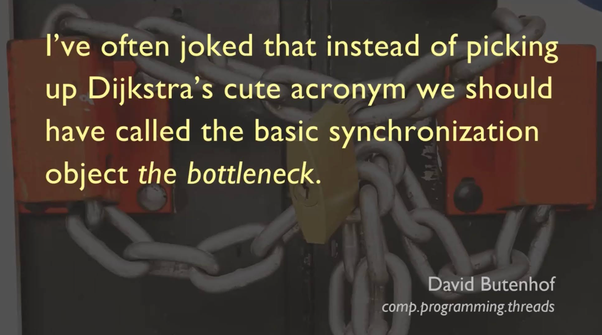
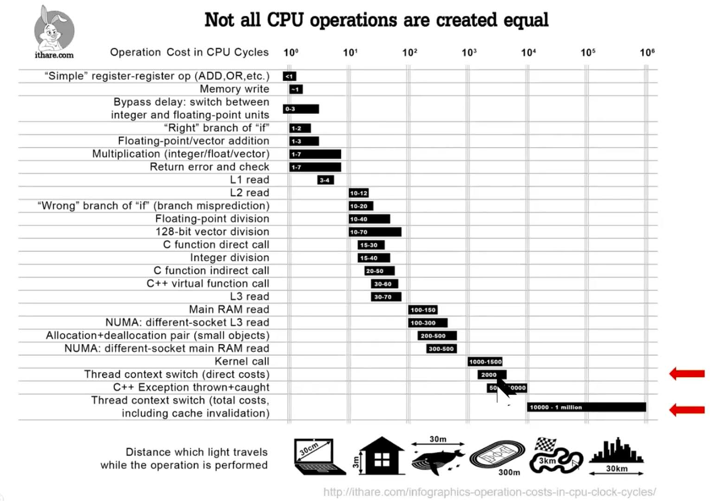

# Parallel Processing (Concurrent Programming) <a name="ParallelProcessing"></a>
  - ### BIG IDEA - It would be useful if we could do more than one thing at the same time on the same computer.

## Threads <a name="Threads"></a>
###### threads
- Threads are a way to run multiple "processes" at the same time, and are used to create "parallel" (or "concurrent") programs.
- Threads are relatively resource-heavy, as each thread requires its own "stack" and "heap" to run, and can be
  challenging to manage and debug when there are many threads running at the same time and sharing mutable state.

- ### Example of Threads in Kotlin **_(NOTE: This code has a race condition problem...)_**
  ```Kotlin
  fun main() {
     var x = 0
     val NUMBER_OF_CYCLES = 100

     val thread1 = Thread {
        for (i in 1..NUMBER_OF_CYCLES) {
           x++
           println("Thread 1: i=$i, x=$x")
           Thread.sleep(10) // milliseconds
        }
     }
     val thread2 = Thread {
        for (i in 1..NUMBER_OF_CYCLES) {
           x++
           println("Thread 2: i=$i, x=$x")
           Thread.sleep(10) // milliseconds
        }
     }
    
     thread1.start() // <-- `start` tells the thread to start running.
     thread2.start() // <-- `start` tells the thread to start running.
     thread1.join()  // <-- `join` tells the main thread to wait here until `thread1` is finished.
     thread2.join()  // <-- `join` tells the main thread to wait here until `thread2` is finished.
       
     println("Final value of x: $x, should be ${NUMBER_OF_CYCLES * 2}")
  }
  
  main()

  // Output:
  // Thread 2: 1, x=0
  // Thread 1: 1, x=0
  // Thread 2: 2, x=2
  // Thread 1: 2, x=2
  // Thread 2: 3, x=4
  // Thread 1: 3, x=5
  // Thread 2: 4, x=6
  // Thread 1: 4, x=7  // <-- Notice that the order of the output is not consistent, as the threads are running concurrently.
  // Thread 1: 5, x=8
  // Thread 2: 5, x=8
  // Thread 1: 6, x=10
  // Thread 2: 6, x=10 // <-- Notice the value of `x` is not consistently incrementing, as the updates are not `atomic`.
  // Thread 1: 7, x=12
  // Thread 2: 7, x=13
  // ...
  // Thread 1: i=98, x=186
  // Thread 2: i=99, x=187
  // Thread 2: i=100, x=188
  // Thread 1: i=99, x=189
  // Thread 1: i=100, x=190
  // Final value of x: 190, should be 200  // <-- Notice final value of `x` is not epected value 200. This is a "Race" condition.
  ``` 
  > Live Code Example: [How Threads Work in Kotlin](src/main/kotlin/threadExample.kt)

## Race Condition Problem Diagram <a name="RaceConditionDiagram"></a>
###### race-condition-diagram
- ### BIG IDEA - The problem with the above example is that the threads are updating the value of `x` at the same time, and the order of the updates is not consistent, so the final value of `x` is not the expected value of `200`.
  
  > What Software Architecture Should Look Like  (Discussions about race conditions at 11:23)
  > - https://youtu.be/ElMnHDSFaCw?si=j5hmYrezRtTGaRj9&t=683
  
- The problem with the above example is that the threads are updating the value of `x` at the same time, and the order
  of the updates is not consistent, so the final value of `x` is not the expected value of `200`.
- This is called a race condition, and is a common problem with threads and other parallel processing systems.
- The problem is that the threads are not "atomic", meaning that the updates to `x` are not guaranteed to be consistent
  and in the correct order, as the threads are running concurrently and updating `x` at the same time.

  ```mermaid
  graph TD
      A[Thread 1] -->|Read then Update x| B[Shared Variable x]
      C[Thread 2] -->|Read then Update x| B
  ```
  - More explicitly:
  ```mermaid
     sequenceDiagram
         autonumber
         participant Thread 1
         participant Shared variable `x`
         participant Thread 2
           Note right of Shared variable `x`: `x` value starts at 0.
         Shared variable `x`->>Thread 1: Read `x` (0).
         Shared variable `x`->>Thread 2: Read `x` (0).
         Thread 1->>Shared variable `x`: Calculate new value & set `x` (1) .
         Note right of Shared variable `x`: `x` value is set to 1.
         Thread 2->>Shared variable `x`: Calculate new value & set `x` (1).
         Note right of Shared variable `x`: `x` value is set to 1 AGAIN - WRONG!
  
         Note right of Shared variable `x`: `x` value should be 2, but is 1 due to race condition.
         Note right of Thread 1: Sometimes the sequence of updates are correct...
         Shared variable `x`->>Thread 1: Read `x` (1).
         Thread 1->>Shared variable `x`: Calculate new value & set `x` (2).
         Shared variable `x`->>Thread 2: Read `x` (2).
         Thread 2->>Shared variable `x`: Calculate new value & set `x` (3).
         Note right of Shared variable `x`: `x` in this case updated correctly to 3.
         Note right of Shared variable `x`: It's random and unpredictable when the updates will be correct.

  ```
## Fixing the threads "race condition" problem by using "Atomic" updates (the `synchronized` keyword) <a name="AtomicUpdates"></a>
###### atomic-updates
- ### BIG IDEA - Is there a way to make the updates to `x` "atomic" so that the threads don't update `x` at the same time?-
  
  - #### The PV acronym in Dijkstra's Algorithm represents the operations associated with semaphore usage: "P" for acquiring or "waiting" on the semaphore (Produce), and "V" for releasing or "signaling" the semaphore (Consume).

  [](assets/race-condition-quote.png)

  ```Kotlin
  fun main() {
     var x = 0
     val NUMBER_OF_CYCLES = 100
     val lock = Any() // Doesn't matter what the type is. It's just used as a lock or "flag" to synchronize the threads.
     
     println("\nFixed Thread Update Problem (race condition) using Atomic updates (synchronized)")
        
     val thread1 = Thread {
        for (i in 1..NUMBER_OF_CYCLES) {
           synchronized(lock) {  // <-- `synchronized` tells the execution to wait here until the lock is released.
              // This block is "locked" so another thread can't update `x` until the current thread is finished.
              x++
              println("Thread 1: i=$i, x=$x")
           } // <-- The lock is released here at the end of the synchronized block.
              Thread.sleep(10) // milliseconds
        }
     }
     val thread2 = Thread {
        for (i in 1..NUMBER_OF_CYCLES) {
           synchronized(lock) {
              x++
              println("Thread 2: i=$i, x=$x")
           }
           Thread.sleep(10) // milliseconds
        }
     }
        
     thread1.start()
     thread2.start()
     thread1.join()
     thread2.join()
        
     println("Final value of x: $x, should be ${NUMBER_OF_CYCLES * 2}")
  }
  
  main()
  
  // Output:
  // Fixed Thread Update Problem (race condition) using Atomic updates (synchronized)
  // Thread 1: i=1, x=1
  // Thread 2: i=1, x=2
  // Thread 1: i=2, x=3
  // Thread 2: i=2, x=4
  // Thread 2: i=3, x=5  // <-- Notice that the order of the output is inconsistent, as the threads are running concurrently.
  // Thread 1: i=3, x=6
  // Thread 1: i=4, x=7
  // Thread 2: i=4, x=8
  // Thread 2: i=5, x=9
  // ...
  // Thread 2: i=98, x=195
  // Thread 1: i=98, x=196
  // Thread 2: i=99, x=197
  // Thread 1: i=99, x=198
  // Thread 2: i=100, x=199  // <-- Notice the value of `x` IS consistently incrementing, as the updates are `atomic`.
  // Thread 1: i=100, x=200
  // Final value of x: 200, should be 200  // <-- Notice the final value of `x` is 200, as expected.
  
  ```
  > Live Code Example: [How to Threads Work in Kotlin](src/main/kotlin/threadExample.kt)
###### atomic-updates-diagram
  - Atomic Update Diagram:
  ```mermaid
    sequenceDiagram
        autonumber
        participant Thread 1
        participant Shared variable `x`
        participant Thread 2
            Note left of Shared variable `x`: `x` value starts at 0.
        critical `synchronized` Atomic update block 
          Shared variable `x`->>Thread 1: Read `x` (0).
          Thread 1->>Shared variable `x`: Calculate new value & set `x` (1).
        end 
        Note left of Shared variable `x`: `x` value is set to 1.
        critical `synchronized` Atomic update block 
          Shared variable `x`->>Thread 2: Read `x` (1).
          Thread 2->>Shared variable `x`: Calculate new value & set `x` (2).
        end
        Note right of Shared variable `x`: `x` value is set to 2.
        Note right of Shared variable `x`: `x` value is updated correctly due to "atomic" updates.
  
  ```
  
## Coroutines <a name="Coroutines"></a>
###### coroutines
  - ### BIG IDEA - Is there a way to simulate parallel execution and avoid the complexity and overhead of threads?
  
  - Coroutines are another way to run multiple processes at the same time, just like threads.
  - Swapping threads in and out of the CPU is relatively resource-heavy, and can be challenging to manage and debug.
    - [](assets/thread-time-diagram.png)
  - Coroutines always run on one or more threads, so threads are still used to run the coroutines, but abstracted away.
  - Coroutines are relatively resource-light and simplify the management of where parts of the program are running, so
    you can have many more coroutines running at the same time than you can have threads. 
  - Coroutines are built-in to the Kotlin language, and are a first-class citizen. Use of coroutines is built-into
    the standard libraries and leveraged by the language itself. 
    
  - ### Example Coroutines in Kotlin (has a race condition problem):
    ```Kotlin
    import kotlinx.coroutines.*  // <-- import the `kotlinx.coroutines` library to use coroutines.
    
    fun main() {
       var x = 0
       
       val job1 = GlobalScope.launch {  // <-- `job1` is immediately started ("launched") to run in the main thread (GlobalScope).
          for (i in 1..NUMBER_OF_CYCLES) {
             x++
             println("Coroutine 1: $i, x=$x")
             delay(10.milliseconds)
          }
       }
       val job2 = GlobalScope.launch {  // <-- `job2` is immediately started ("launched") to run in the main thread (GlobalScope).
          for (i in 1..NUMBER_OF_CYCLES) {
             x++
             println("Coroutine 2: $i, x=$x")
             delay(10.milliseconds)
          }
       }
       
       runBlocking {
          job1.join()  // <-- `join` tells the main thread to wait here until `job1` is finished.
          job2.join()  // <-- `join` tells the main thread to wait here until `job2` is finished.
       }
       
       println("Final value of x: $x, should be ${NUMBER_OF_CYCLES * 2}")
    }
    
    // Output:
    // Coroutine 2: 1, x=1
    // Coroutine 1: 1, x=2
    // Coroutine 2: 2, x=3
    // Coroutine 1: 2, x=4
    // Coroutine 2: 3, x=5
    // Coroutine 1: 3, x=6
    // Coroutine 2: 4, x=7
    // Coroutine 1: 4, x=8
    // Coroutine 2: 5, x=9
    // Coroutine 1: 5, x=10
    // Coroutine 2: 6, x=11
    // Coroutine 1: 6, x=12
    // Coroutine 1: 7, x=14 // <-- Notice the order of the output is inconsistent, as the coroutines run concurrently.
    // ...
    // Coroutine 1: 8, x=14 // <-- Notice the value of `x` is inconsistently incrementing, as the updates are NOT "atomic."
    // Coroutine 2: 8, x=14
    // Coroutine 1: 9, x=16
    // Coroutine 2: 9, x=17
    // ...
    // Coroutine 2: 99, x=192
    // Coroutine 1: 99, x=193
    // Coroutine 1: 100, x=194
    // Coroutine 2: 100, x=195
    // Final value of x: 195, should be 200 // <-- Notice final value of `x` is 195, not the expected 200. This is a race condition.
    ```
    > Live Code Example: [How Coroutines Work in Kotlin](src/main/kotlin/coroutineExample.kt)

  - ### Fixing the Coroutine race condition problem using Atomic updates (using `StateFlow` class) <a name="AtomicUpdatesCoroutines"></a>
    - ###### fixing-updates-with-coroutines
    ```Kotlin
     fun main() {
        val x = MutableStateFlow(0)
     
        println("\nFixed Coroutine Update Problem using Atomic updates (StateFlow)")
           
        val job1 = GlobalScope.launch { // <-- `job1` is immediately started ("launched") to run in the main thread (GlobalScope).
           for (i in 1..NUMBER_OF_CYCLES) {
              x.update { it + 1 }  // <-- `update` tells the execution to wait here until the updating lock is released, like the `synchronized` block.
              println("Coroutine 1: i=$i, x=${x.value}")
              delay(10.milliseconds)
           }
        }
           
        val job2 = GlobalScope.launch { // <-- `job2` is immediately started ("launched") to run in the main thread (GlobalScope).
           for (i in 1..NUMBER_OF_CYCLES) {
              x.update { it + 1 }  // <-- `update` tells the execution to wait here until the updating lock is released, like the `synchronized` block.
              println("Coroutine 2: i=$i, x=${x.value}")
              delay(10.milliseconds)
           }
        }
           
        runBlocking {
           job1.join()  // <-- `join` tells the main thread to wait here until `job1` is finished.
           job2.join()  // <-- `join` tells the main thread to wait here until `job2` is finished.
        }
           
        println("Final value of x: ${x.value}, should be ${NUMBER_OF_CYCLES * 2}")
     }
     
     // Output:
     // Fixed Coroutine Update Problem
     // Coroutine 2: 1, x=2
     // Coroutine 1: 1, x=1
     // Coroutine 2: 2, x=4
     // Coroutine 1: 2, x=3
     // Coroutine 2: 3, x=5
     // Coroutine 1: 3, x=6  // <-- Notice that the order of the output is inconsistent, as the coroutines run concurrently.
     // Coroutine 1: 4, x=8
     // Coroutine 2: 4, x=7  // <-- Notice the value of `x` IS consistently incrementing, as the updates are `atomic`.
     // Coroutine 1: 5, x=9
     // Coroutine 2: 5, x=10
     // Coroutine 2: 6, x=12
     // ...
     // Final value of x: 200, should be 200 // <-- Notice the final value of `x` is correct.
    ```
    > Live Code Example: [How Coroutines Work in Kotlin](src/main/kotlin/coroutineExample.kt)
  
## Coroutines are Much Faster Than Threads <a name="CoroutinesVsThreads"></a>
###### coroutines-vs-threads
  - ### BIG IDEA - Coroutines are much faster than threads, as they are much lighter weight and can be run in parallel on the same thread.
  
  - Instead of swapping out the entire stack and heap of a thread each time the task is swapped, coroutines can be 
    paused and resumed at any point in the execution of the coroutine, and can be run on the same thread as other 
    coroutines.
  - This is due to change in the language and the JVM to support coroutines, and the use of "continuations" to save 
    the state of the coroutine at any point in its execution, and then resume the coroutine from that point at a later 
    time.
    
    > Live Code Example: [Coroutines vs Threads 100,000 tasks time comparison](src/main/kotlin/coroutineVsThreadExample.kt)
    
- [Continue Reading - Conclusion](./13-Conclusion.md)
- [Back to Index](README.md)