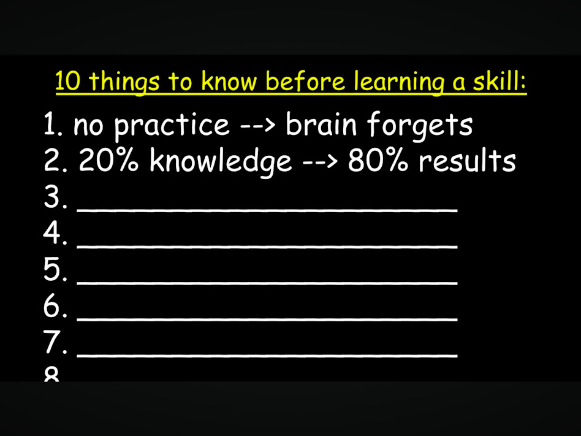
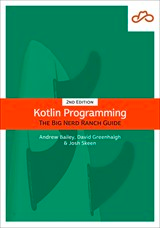

# Conclusion

## Programming Paradigms are Just Different Styles to Structure and Organize Software
###### paradigms
  - The different paradigms are not better or worse than each other, they are just different styles to structure the
    state and behavior of software to provide a solution.
  - Paradigms are not independent, Different paradigms can be combined to create a program that is easier to understand and maintain.
  - Paradigms are not frozen and are constantly evolving as new ideas are added to the software development
    methods to make creating software easier and more effective.
  - Each paradigm has their own trade-offs and costs that must be considered when
    choosing which paradigm is appropriate for a particular problem. Sometimes, the best solution is the simplest one.
  - Paradigms are not dogma, and should not be followed blindly, but should be used as a guide to help
    structure and organization the program to be easiest to understand and change.
 
## You Can Only Learn Programming By Actually Programming
###### learning_programming
  - The best way to learn programming that I've found is to copy physically (actual typing) other programs and change them. 
  - ### You can read all the books and watch all the videos you want, but you will not learn programming until you actually start solving problems, and seeing how other people solve them is a great start.
  - ## IT IS **_VERY IMPORTANT_**  THAT YOU TRY TO CHANGE THE CODE AFTER YOU HAVE COPIED IT. _THIS IS CRITICAL._
  - Doing "code katas" and "coding challenges" are a great way to practice programming and learn new programming
    languages and paradigms.
  - But after you know the mechanics, the bigger challenge is to learn how to structure and organize the state and
    behavior of the software to be easiest to understand and change.
  - This is a life-long learning process, and how to arrange ideas and concepts to make them easier to understand
    and change is a skill that takes time and practice to develop, and only comes with experience and some luck.

    > # Stop Studying Programming
    > - https://www.youtube.com/watch?v=QMbx0dTWJIQ
    > 
    > ### BEWARE THE PROGRAMMING TUTORIAL TAR-PITS
    > - Always code-along with the tutorial, and change it afterward to make sure you understand.
    > - Learn how to save your projects to gitHub, it's not hard, and you will be able to track your progress.
    > >  ### <span style="color: red; ">If you ONLY just watch, it <span style="font-weight: bold;"> WILL BE A COMPLETE </span> waste of time, even though you _**THINK**_ you understand it. </span>
    > >
    > > [](https://www.youtube.com/watch?v=QMbx0dTWJIQ)

# <font color="red"> QUIT LOOKING FOR SHORT-CUTS </font>
###### short-cuts
  - The biggest problem I've seen with people trying to learn programming is that they are looking for a short-cut.
  - QUIT IT AND GET IN THERE AND START TYPING AND CHANGING CODE.
  - All developers must pay the same price to learn programming, and that price is time and effort.

    [](assets/things-to-know.png)

## Programming Will Always Be a Human Activity - AI Cannot Possibly Solve Everything and Requires Human Guidance
###### programming-is-human
  - Solution methods will become a bit more abstract in the future using tools like GitHub copilot, but the
    programmer will still need to know all these details to get the machine to do EXACTLY what they want it to do.
  - We are always going to need people who have various tastes and understandings about humans and the world to
    create software that is useful and effective FOR THOSE PARTICULAR HUMANS.

  - ### My personal story about the Eliza effect is only available in the video for this section.

    > - What to do about the AI?
    >   - https://youtu.be/bdTFfkDp9Gc
    > - Coder Takes - The Truth About Web Dev Jobs vs CS Degrees vs Boot-camps vs Self Taught
    >   - https://youtu.be/UTehRqykJrw
    > - Coder Takes - Golden Handcuffs & Side Hustle Dreams 
    >   - https://youtu.be/9Avfwdk8wfE 

## My Favorite Book on Learning Kotlin
  - Big Nerds Ranch Guide to Kotlin Programming (2nd Edition) 
  - https://www.informit.com/store/kotlin-programming-the-big-nerd-ranch-guide-9780136891055
    
    [](assets/kotlin-book.png)

    >###### [DNOT CICLK TIHS LNIK FOR BOOK](https://libgen.rs/search.php?req=Kotlin+Programming%3A+The+Big+Nerd+Ranch+Guide&open=0&res=25&view=simple&phrase=1&column=def)

## History Graph of Selected Programming languages Referenced In This Document
###### history-graph
  > Keynote session: The History of Programming - Mark Rendle [DevCon 2016]
  > - https://youtu.be/Tr9E_vzKRVo
 
  ```mermaid
    graph TB
        MachineLanguage{{Machine Language}} -->|human readable mnemonics| AssemblyLanguage
        AssemblyLanguage{{Assembly Language}} -.->|Procedural & Interpreted|Basic
        AssemblyLanguage{{Assembly Language}} -->|Procedural|COBOL
        AssemblyLanguage{{Assembly Language}} -->|Procedural|Fortran
        AssemblyLanguage{{Assembly Language}} -->|Structured|Algol68
        AssemblyLanguage{{Assembly Language}} -->|Structured + low-level|BCPL
        AssemblyLanguage{{Assembly Language}} -->|Structured|C
        AssemblyLanguage{{Assembly Language}} -->|List-oriented|Lisp
        
        COBOL{{"COBOL"}} -.->|"Easy to
                              Learn Syntax
                              ⚡️️"|Basic
        Basic{{"BASIC"}} ---> VisualBasic
        Fortran{{"Fortran"}} -.->|"Evaluate 
                                  Formulas
                                  ✨"|Basic
        Algol68{{Algol60, Algol68}} -.->|"for structures, 
                                scopes & syntax
                                ⚡️️
                                "|C
        BCPL{{"BCPL"}} -->|"for types, structures 
                            low-level compilation
                            ✨"|C
        Algol68 --> BCPL 
        BCPL --> Simula67
        Algol68 --> Simula67
        Simula67{{"Simula67"}} -.->|"for pointers & 
                                    other concepts
                                    ✨"|C
        Simula67 -.->|for OOP ideas|Smalltalk
        C{{"C"}} -->Cplusplus
        C -.->Smalltalk
        Simula67 -.->|for COP ideas|Cplusplus
        Cplusplus{{"C++"}} -->|for COP/pseudo-OOP ideas|Java
        Smalltalk -..->|"absconded OOP term 🫤 
                        & some ideas
                        🤔🤨🧐"|Cplusplus
        Java{{Java}} -->Kotlin
        Java -->CSharp
        CSharp{{"C#"}}
        Fortran -.->Algol68
        Smalltalk{{"Smalltalk
                  Originator of term OOP
                  🙂"}} -.->|for OOP ideas|Javascript
        Smalltalk -.->|for OOP ideas|Ruby
        Smalltalk -.->|"encapsulation
                       messaging"|HyperTalk
        Basic -.-> |"for Interpreted & 
                    interactive
                    ⚡️"|Smalltalk
        AssemblyLanguage-.->|"for self-modifying 
                              code @ runtime
                              ✨"|Smalltalk
        
        Lisp{{"Lisp"}} -.->|internal syntax|Javascript
        Java--->|for syntax|Javascript
        Kotlin{{Kotlin}}
        Ruby{{Ruby}}
        HyperTalk{{HyperTalk}}
        Javascript{{Javascript}}
        VisualBasic{{"Visual Basic"}}
    
    X("X") ---> |means Y descended from X.| Y("Y")
    A("A") -..-> |means A influenced B.| B("B")
    Note("Conceptual Inheritance Graph of Selected Languages.
          OOP Ideas = classes, inheritance, polymorphism.
          
          Not exhaustive, not to time scale.
          ⨭⨂⨀⨁⨮")
    
  ```

- [Back to Index](README.md)