# How to Program From The Ground Up with Minimal BS

## Introduction
  - Discussion from the fundamentals of physical logic representation to the high level programming languages.
  - The goal is to understand more the "why" and "how" of programming, not just the "what" and "where"

  - People used to do all computing by hand, and now we use various machines to do the same thing, 
    in a much faster and more reliable way.
    - When we use a machine to do computing, we are just using the machine to represent the problem and the 
      solution in a different way.
    - The machine knows nothing about the problem. it's only following orders created by clever humans using 
      boolean logic to represent the problem and its sequence of actions to solve it.
    - Each operation in the computer was once done by teams of people working in groups, logically delineated in 
      nearly the same way as the computer's components are arranged.
        - There were specialized roles for each person, for example, the "storage" would be a set of filing cabinets and a clerk to store and retrieve them.
          - This is now done by the "hard drive" and the "file system" in the computer.
        - The arithmetic would be done by a person called a "calculator" who would perform the operations and record the results.
          - This is now done by the "Arithmetic Logic Unit" and the "Registers" in the computer.

# The Essence of Computing — What are we Representing?
  - Everything in computing is REPRESENTING digital information "as" something _else_.
  - Kinds of representations through history:
    
    - Knots & Beads on a string - prehistoric, 6000 BC to 1500 AD
      - [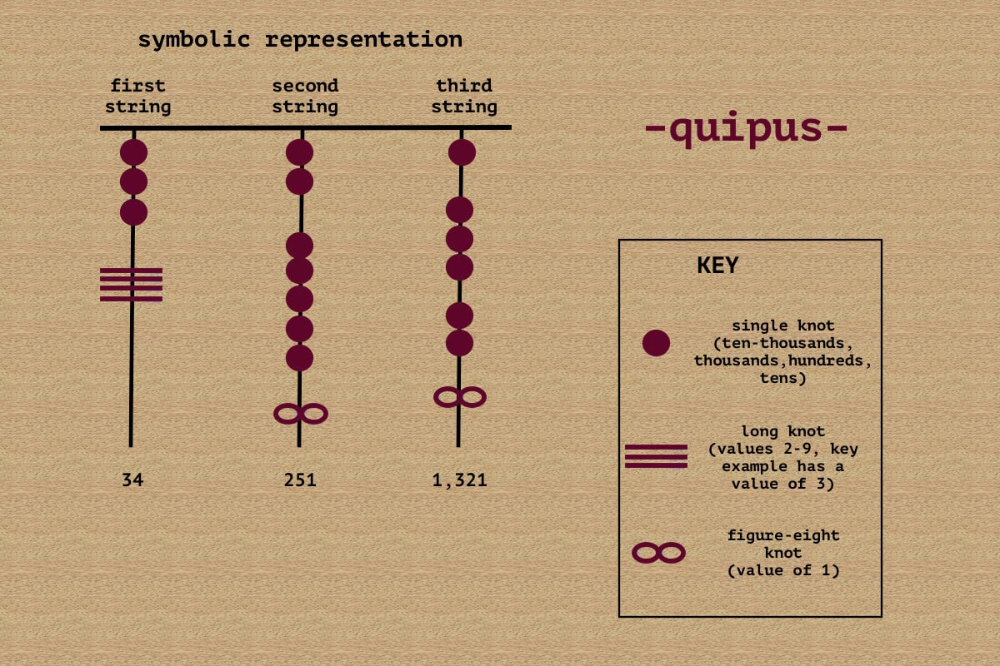](https://www.peruforless.com/blog/quipu/)
    
    - Physical indentations in clay - 8000 BC to 100 AD
      - [](https://www.thoughtco.com/clay-tokens-mesopotamian-writing-171673)
      - [](https://www.thoughtco.com/clay-tokens-mesopotamian-writing-171673)
    
    - Beads on an abacus - 3000 BC to present
      - [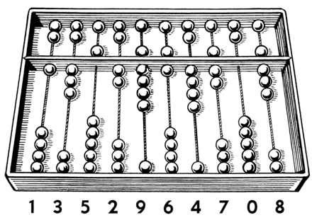](https://en.wikipedia.org/wiki/Abacus) 
    
    - Ink Marks on paper - 3000 BC to present
        - [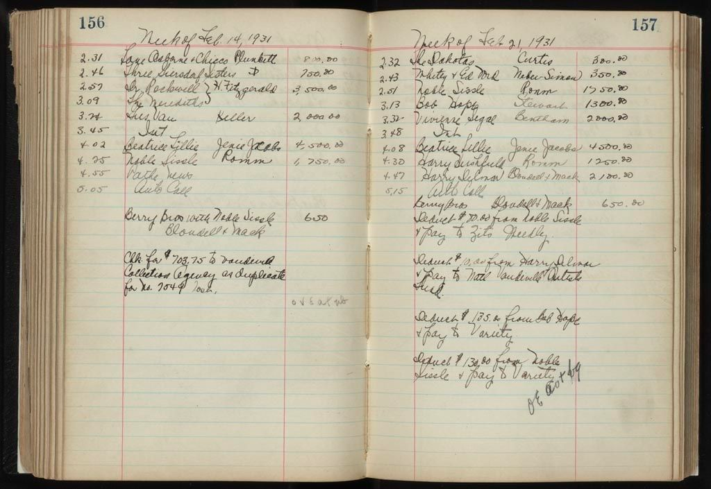](https://www.moderntreasury.com/journal/history-of-ledgers)
    
    - Punched Holes in a paper card - 1800s to 1970s
      - Vast improvement over the paper ledger
      - Collection of data was standardized, fast and could be read by a machine
      - Data collected from the 1890 US Census was the first large scale use of punched cards
      - Allowed for the first "programmable" machines that could be used to perform relatively complex tasks 
        like sorting and counting of specific data
      - [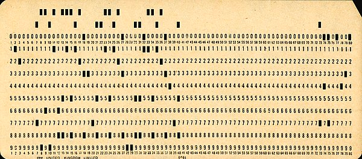](https://en.wikipedia.org/wiki/Punched_card)
      - [](https://en.wikipedia.org/wiki/Hollerith_machine)
      - 1889 Herman Hollerith Census Machine by TMC which became IBM
        - https://www.youtube.com/watch?v=9HXjLW7v-II
    
    - Remnants of photons hitting a piece of glass coated with a thin layer of phosphor - 1940s to 1980s
      - [](https://en.wikipedia.org/wiki/Williams_tube)
      - [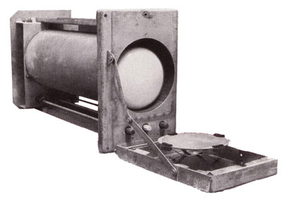](https://en.wikipedia.org/wiki/Williams_tube)
      - [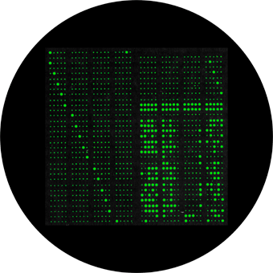](https://ub.fnwi.uva.nl/computermuseum/williamstube.html)
      - Manchester Baby and the birth of Computer Memory
        - https://www.youtube.com/watch?v=SpqayTc_Gcw
         
    - Magnetic Phenomenon - 1950s to present
      - Electronically detectable areas on magnetizable material, or the presence of a magnetic field in a specific area
      - Core Memory - 1955 to 1975
        - [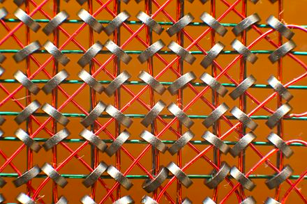](https://en.wikipedia.org/wiki/Core_memory) 
      - Magnetic Tape - 1928 to present
        - [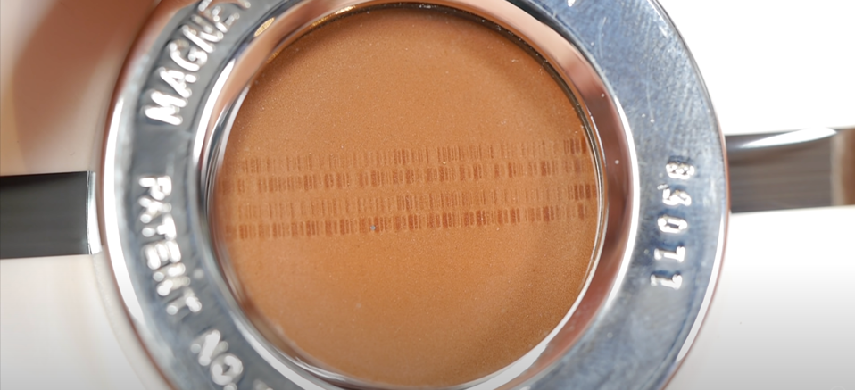](https://www.youtube.com/watch?v=aZOxn8ggX8w)
      - Magnetic Disk - 1956 to present
      - [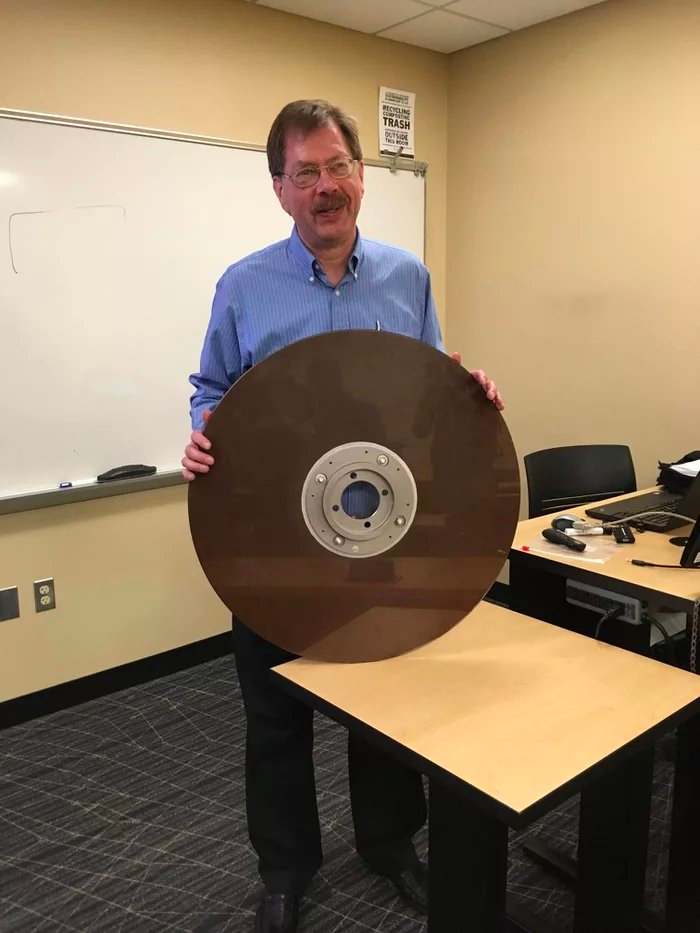](https://en.wikipedia.org/wiki/IBM_305_RAMAC)
    
    - Detectable electrical capacitance in a tiny area of silicon - 1960s to present
      - [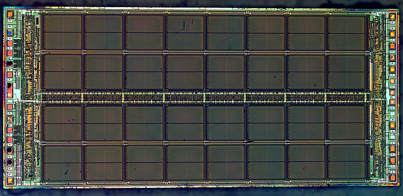](https://en.wikipedia.org/wiki/Dynamic_random-access_memory)
  
  - Creating ANY machine capable of using boolean logic enables complex custom general solutions
    - The problems must be able to be represented with binary information and the solution must be able to be 
      represented with a series of logical operations.
    - By building up from the simple logic of `AND`, `OR`, and `NOT` operations, humans can create an 
      arbitrarily complex sequence of logical operations.
    - These logical operations are sequenced in time to create "State Machines" that can perform complex tasks 
      and solve complex problems. A state machine is simply a way of representing the problem that changes over time 
      controlled by a series of logical operations & conditions that lead to certain states and available actions.
    - These logical operations are built up using patterns called "algorithms" grouped together in "programs" that
      can be executed by a digital computer.
    - All of this is based on human ingenuity and cleverness, as the computer knows nothing about the problem. 
    - It's just following the logical operations that humans have carefully designed to represent the problem and a solution.

# HARDWARE

# Low Level Hardware Implementations
  
  - ## The Wire & the Light Bulb & the Battery
    - We are using this arrangement to represent a logic "state" 
      - This is the most basic representation of a "state" in computing
    - Connected or not connected? (1 or 0)
      - But we dont really know it's state until we measure it somehow (like with a voltmeter or a light bulb) 
    - Add visual Feedback - Light on or off (1 or 0)
    - Even though the light has in reality many, many different states constantly 
      changing over time, we can still use it to represent a single state at time: Either on or off.
    - In this way we can use the light to represent a "bit" of information, which is the most basic unit of information in computing.
  
  - ## The Simple Switch
    - Easier to manipulate for humans than a bare wire
    - Can be physically manipulated using electricity to change state using an electromagnet.
    - Simple switches can be used to represent boolean logic operations
    - These operations are called "gates", conceptually similar to someone following path crossing a fence through a gate
    
    - ### Logical Operations & Boolean Arithmetic
      - true = 1 = on = connected
      - false = 0 = off = not connected
      - Two switches in series represent a Logical AND gate
        - `AND` ( the `&&` symbol )
          - 0 && 0 => 0
          - 0 && 1 => 0
          - 1 && 0 => 0
          - 1 && 1 => 1
      - Two switches in parallel represent a Logical OR gate
        - `OR` ( the `||` symbol) 
          - 0 || 0 => 0
          - 0 || 1 => 1
          - 1 || 0 => 1
          - 1 || 1 => 1
      - Boolean logic requires one more operation to be complete: The logical `NOT` operation...

    - Insight 1: Logic in Physical Form
      - https://www.youtube.com/watch?v=txH3K3shIWs
  
  - ## The Magnificent Magnet
    - Magnets can be electrically controlled to cause mechanical actions on certain metallic materials
    - Certain Metallic Materials can be "magnetized" and "polarized" using electricity to represent a "state"
      - Magnetized or not (1 or 0) 
      - North or South (1 or 0)
      - It's magnificent bc its so useful and versatile
    - How To Make an Electromagnet 
      - https://youtu.be/Vpb7IQ2Ib_Y
    - Magnetic Viewing Film - How it Works/Demos 
      - https://www.youtube.com/watch?v=slVL5nbTXd4
  
  - ## The Raucous Relay
    - Uses an electromagnet to control a switch (or multiple switches)
    - the first electrical computers were made of relays (extremely slow but faster than writing by hand!)
    - If a circuit is designed to turn a switch OFF when the relay is electrified, this creates a logical NOT gate, 
      so using a relay in this way allows us to represent any other logic gate.
    - NOT (!)
        - !0 = 1
        - !1 = 0
    - The relay can be used to represent any other logic gate
    - It's raucous because it makes a lot of noise
    - AND OR NOT gates with Relays
      - https://www.youtube.com/watch?v=FKub2SuugsQ
    - Computers built using Relays
      - https://youtu.be/e8DavnWmr1E
      - https://youtu.be/NXeBR-lbnjI
  
  - ## The Voracious Vacuum Tube
    - How Vacuum Tubes Work 
      - https://www.youtube.com/watch?v=nA_tgIygvNo
      - Note: While the actual physical electron flow direction is from the "negative" terminal to the 
        "positive" terminal, the "conventional" flow direction of electricity in schematics is considered to go 
        from the "positive" terminal to the "negative" terminal. 
      - _Yes!_ this is rather confusing at first, and you can give thanks Ben Franklin for his technical debt we 
        all have to deal with at the beginning of learning electronics.
    - Electricity in a vacuum behaves differently than in normal atmosphere. Electrons can flow freely in a vacuum. 
      - Tubes exploit this behavior of electrons in a vacuum to perform like a switch or an amplifiers.
    - Tube made for use in logic (Triode) consists of three parts:
      - **"Cathode"** 
        - Essentially a light bulb filament tied to the common "ground/negative" terminal of the power supply.
        - Negative terminal of the tube it used to "emit" electrons to the anode and complete the circuit.
      - **"Anode"** 
        - Positive terminal of the tube hooked to the "load" and the positive terminal of the power supply.)
        - Used to "collect" electrons from the cathode and to indicate "state" and complete the circuit.
      - **"Grid"** 
        - this acts as a switch also called a "valve" when referring to tubes.
    - The Grid can be used to control the flow of electricity between the cathode and anode.
      - ie: when the grid is positively charged, the flow of electricity from cathode to the anode is allowed.
      - ie: when the grid is negatively charged, the flow of electricity from cathode to the anode is deterred.
      - This acts by default like a logical "NOT" gate.
    - The tube can be used to represent any other logic gate
    - The vacuum tube is voracious because it consumes a lot of power to heat the cathode and generates a lot of heat
  
  - ## The Tiny Transistor
    - Very similar behavior to the vacuum tube, but much smaller and faster
      - How a transistor works
        - https://www.youtube.com/watch?v=DXvAlwMAxiA
      
    - No vacuum required, just a the semiconductor material.
      - Uses photographic techniques to create the transistor, not regular metallic parts.
    - The transistor consists of three parts:
      - **"Drain"** 
        - (the "anode" in the vacuum tube.) 
        - also known as "collector" or "sink" often connected to "load." 
        - (not always "positive" in modern transistors, but usually is.)
      - **"Source"** 
        - (the "cathode" in the vacuum tube) 
        - also known as "emitter" often connected to "ground." 
        - (not always "negative" in modern transistors, but usually is.) 
      - **"Gate"** (the "Grid" in the vacuum tube.) 
        - also known as "base" often connected to the "control." 
        - (not always "positive" in modern transistors, but usually is.)  
    - The transistor can be used to represent any other logic gate and is the current basis for all modern computing.
    - The transistor is tiny because it is very small and fast, bumping up against the limits of physics on how 
      small it can be made.
    - Transistors can create sophisticated operations by combining them in clever ways
      - Designing a 7-segment hex decoder
        - https://www.youtube.com/watch?v=7zffjsXqATg 
      - Transistor Clock
       - https://www.youtube.com/watch?v=Iu-W7LpSDmk  

    - ### How to Build Complex Logic Gates from Simple Transistors
      - Using a transistor to solve our problem - How transistors work as a switch
        - https://www.youtube.com/watch?v=ks_VShSgPns
      - Inverting the signal with a transistor (The `NOT` gate)
        - https://www.youtube.com/watch?v=hYN8C769k8A
      - Making logic gates from transistors 
        - https://www.youtube.com/watch?v=sTu3LwpF6XI
      - How does memory work?
        - SR Latch 
        - https://youtu.be/KM0DdEaY5sY
      - Insight 2: The MOS Transistor
        - https://www.youtube.com/watch?v=sshPV7BV0k0
  
  - ## The Interchangeable Integrated Chip (IC) 
  - Groups of transistor logic gates packaged together to perform a specific task
  - Robert Noyce, inventor of first monolithic IC 
    
    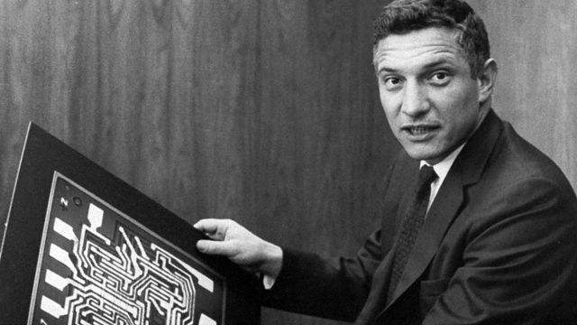
  - Typical Early Logic Gate Package
    
    
  
  - Close up of silicon wafer wired to package
    
    
     
  - The logic gate "package" 
  - A Package is a group of transistors for a specific logic operation placed on a single chip contained in a plastic 
    or ceramic enclosure with metal pins to connect to the rest of the computer.
    - Basic functions consist of Logical OR, AND, NOT, NAND package (usually 2-4 gates in the same package)
    - Extremely complex functions are made by combining many of these packages together in clever ways
    - “MY FIRST CHIP” - Carver Mead - 2017
      - https://www.youtube.com/watch?v=F5P5SAlEbo4
  - Why is NAND gates so special?
    - It's the most flexible can be combined to create any other logic gate, ie: AND, OR, NOT, XOR, etc.
      1) tie inputs A & B together to create a NOT gate
      2) tie inputs A & B together combined with a NOT gate to create an OR gate
      3) use normal A & B inputs and combine with a NOT to create an AND gate
    - Everything in computers can be done with just these three types of gates
    - Most early digital electronic calculators were made solely with many IC's of these NAND gates
    
  - ## The Mighty Microprocessor (groups of integrated chips -> all put on one chip)
    - Contains a CPU (Central Processing Unit) and a small amount of ultra fast memory (called "Registers")
    - The CPU is just a clever and somewhat complex arrangement of logic gates that can perform a series of logical operations
      - An intuitive approach for understanding the CPU and RAM
        - https://www.youtube.com/watch?v=-IyB8hBkA9w
      - How a CPU Works
        - https://www.youtube.com/watch?v=cNN_tTXABUA
    
    - Each part of the CPU is made of millions of the same kinds of logic gates that we've already discussed
    - The CPU has a "clock" to synchronize the operations of the CPU
    - It also has a "program counter" to keep track of the current instruction in memory that the CPU is executing
    - Has an "ALU" (Arithmetic Logic Unit) to perform basic arithmetic and logical operations
      - How does an ALU work? 
        - Learn how computers add numbers and build a 4 bit adder circuit 
        - https://youtu.be/wvJc9CZcvBc 
    - May contain a small amount of "cache" memory (very fast memory near the CPU circuits) to speed up access to main memory
    - CPU's are where the execution of each instruction happens

  
  - ## The Configurable Computer
    - ROM (Read Only Memory 
      - usually contains the basic software to start the computer, sometimes called "firmware")
      - Not easy to change, but can be changed with special equipment.
      - https://www.youtube.com/watch?v=3l5q0xaQEf8
    - RAM (Random Access Memory) 
      - https://www.youtube.com/watch?v=uYXwCBo40iA
      - RAM - Random Access Memory - How does a RAM of PC store data?- Video IT
        - https://www.youtube.com/watch?v=Kav6oOFDQSA
      - Dynamic Random Access Memory (DRAM). Part 1: Memory Cell Arrays
        - https://www.youtube.com/watch?v=I-9XWtdW_Co
    - IO & Peripherals & Removable Storage & More
      - All just more variations of the same thing
        - All built up from the same basic logic gates and transistors, or similar technology
        - Even video cameras, microphones, radios and speakers are just variations of the same basic technology
      - using the same principles to represent logic states and perform logical operations
      - Often electromagnets to control mechanical devices or other machines
        - The classic example is the "hard drive" which uses a spinning disk and a moving arm to read and write data
        - The "hard drive" is a "magnetic" storage device, and uses tiny spots of "magnetized" material to represent the "state" of the data
        - The arm is controlled by software and uses "magnets" to move the arm to the correct position to read and write the data
        - Some sort of electrified magnet is the usual way that computers interact physically with the world

# SOFTWARE

# Machine Code — The Microcode Soft-Circuitry Commands of the CPU
  - Machine Code is the "language" of logical operations that the computer can perform
    - It's really just human cleverness setting up problems in a way 
        that the machine can perform simple logical operations to give 
        us a representation of the result of the problem
    - Anything the computer can do is just a combination of these simple logical operations, designed by people
      to represent the problem to be solved by a digital computer using a series of logical operations & states
    - The specific instructions for the CPU are called operation codes, or "opcodes", and are just strings of 
      arbitrary binary numbers like 1010101011010101 that represent the logical operations that the CPU can perform.
    - The opcode values are completely dependent on the specific CPU, and are usually defined by the manufacturer of the CPU.
    - These numbers are usually represented in hexadecimal (base 16) to make them easier to read and write (as opposed to binary, base 2)
    - The opcodes are the most primitive logical operations that the CPU can perform
    - The opcodes are usually followed by "operands" which are the "arguments" to the operation
  - The Machine opcodes are unwieldy for humans to remember, so we use "mnemonics" to represent them
    - Mnemonics are just human-readable names for the opcodes, like "LOAD" or "STORE" or "ADD" or "SUBTRACT"
    - The mnemonics are then translated into the binary opcodes by a "compiler" or "assembler"

  - ## Representing Values in Memory 
    - ### Binary Counting
     
    - 
    - ### Hexadecimal Counting
      
      
    - ### ASCII Representation of Characters
      - ASCII is a 1 byte (8 bit) representation of the most common letters and symbols used in English
      - ASCII stands for "American Standard Code for Information Interchange"
      - Note: The bits are used to categorize the characters into different groups & very intentionally designed
      - The first 32 characters are "control characters" and are not printable. 
        The control codes are used to synchronize communication between devices, like "start of text" or "end of transmission"
      - Look at the numbers in the ASCII table and see if you can see the pattern
        - The Capital letters are 1 bit higher than the lowercase letters
        
      
      - ASCII table using Hexadecimal - Easier to read by humans, much more compact than binary
      - 2 Hexadecimal Characters can represent 1 byte
        

  - ### Computer Block Diagram
    - 

    - The MPU (Microprocessor Unit) is the "brain" of the computer (CPU) 
    - 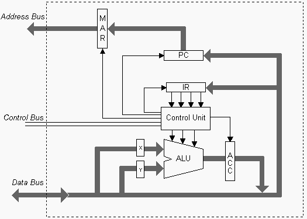

  - ### Clock — "The heart beat of the CPU to keep it all in sync"
    - Clock Circuit - Basically a emits a short pulse of electricity at a regular interval
      - a "tick" of the clock, like flashing a light to the beat
      - Often uses a quartz crystal (XTAL in schematic) and the piezoelectric effect to keep a steady beat, like a watch
      - Can also use a 555 timer chip to generate a clock signal
    - Used synchronizes the operations of the CPU
      - Example Implementation - Astable 555 timer - 8-bit computer clock - part 1
      - https://www.youtube.com/watch?v=kRlSFm519Bo 
    - Everything in the computer happens one step at a time, and the clock is the thing that makes the "steps"
    - Each "tick" of the clock is called a "cycle"
    - The cycle of the clock is not the same as the cycle of the CPU, but the CPU normally does one operation per cycle
      but some operations may take more than one clock cycle to complete.
  
  - ### Program Counter (PC) - "Where in memory is the current instruction being executed?"
    - The "program counter" (PC) is a special register that keeps track of the current memory location of the
      current instruction that the CPU will execute/is executing
    - All instructions are processed one at a time per CPU, and never more than 1 instruction at a time.
    - Defaults to the first memory location(0x00000000), and then increments by 1 after each instruction is executed
    - The "program counter" is updated by the "clock" at the end of each "cycle", or when a "jump" instruction is executed

  - ### Common Machine Code Opcodes (actual opcode is for Motorola 6502 CPU)
    - `Hex: Opcode Mnemonic`
    - `0xA9: LDA` Load a value from main memory into a register
    - `0xA2: MOV` Move a value from one register to another
    - `0x8D: STA` Store a value from a register into main memory
    - `0x4C: JMP` Start executing next instruction at a different location in main memory by updating the Program Counter with a new value
    - `0x6D: ADC` Add the values in two registers and store the result in a third register and update the "carry flag" register if there is a "carry"
    - `0xCD: CMP` Compare the values in two registers and update the "flags" register with the result
    - `0xD0: BNE` If the "flags" register is not zero, start executing at a different location in main memory ie: "conditional branching"

  - ### Fetch-Decode-Execute Cycle of the CPU — "The Dumb-Quick-Work of the CPU"
    - Fetch means to get the next opcode instruction from main memory address in the PC and puts the opcode into 
      the "Instruction register (IR)" on the CPU
    - Decode means to figure out what the opcode operation is and what the operands are (if any)
      - "Operands" are the "arguments" to the operation. ie: the "source" and "destination" of the operation 
      - The operation may need to fetch more data from main memory or from a register to get the operands for the instruction
      - The operation may take more than one cycle to prepare for execution
    - Execute means to actually perform the operation
      - For example: opcode 0x6D means add the values in X & Y registers and store the result in the ACC register, 
        then set a flags register if the result is negative or had to carry a bit
      - The operation may require more than one cycle to complete (cpu-cycle)
      - The number of cycles is totally dependent on the specific CPU and the specific operation
      - The operation may need to store the result back into main memory or into one or more registers
    - After the operation is complete, the program counter (PC) is updated with the address of the next instruction to 
      be executed (or with a different location in memory if a "jump" instruction is executed)
    - The "fetch-decode-execute" cycle is the basis for all computing, and is the most important part of the CPU
  
  - ### Registers — "The Tiny Superfast Memory Nearest to the CPU & Keeps the State of the CPU"
    - Registers are a small amount of super fast memory that is built into the CPU
    - The registers are used to store the results of the instructions, and current operands being executed
    - The registers are used to store the current "state" of the CPU, like the "program counter" and the "flags" register
      - Some registers store the values of the last arithmetic operation, like from an "ADD" or "SUBTRACT" 
      - Some registers are a series of "status flags", single bits used to store the result of the last operation
      - Status flags are used to control the "conditional jumps" in the program
      - Flags such as "zero" or "carry" are used to indicate the results of the last operation
      - For example: 
        - if the result of the last operation was zero, then the "zero" flag is set to 1; otherwise it's set to 0
        - if the result of the last operation was negative, then the "negative" flag is set to 1; otherwise it's set to 0
        - if the result of the last operation had to "carry" a bit, then the "carry" flag is set to 1; otherwise it's set to 0

  - ### Arithmetic Logic Unit (ALU) — "The Calculator of the CPU"
    - The ALU is the part of the CPU that performs the basic arithmetic and logical operations
    - The ALU is used to perform the "Add" and "Subtract" operations
      - Stores the result of the operation in the "Accumulator" register  
      - Sets the "carry" flag if the result of the operation had to "carry" a bit
      - Sets the "negative" flag if the result of the operation was negative
    - The ALU is used to perform the "Compare" operation, and all other logical operations operations
        - Sets the "Zero" flag if the result of the operation was zero
        - Sets the "Greater" flag if the result of the operation was greater than the other operand
        - Sets the "Less" flag if the result of the operation was less than the other operand
        - Sets the "Equal" flag if the result of the operation was equal to the other operand
        
  - ### Control Unit
    - The "Control Unit" is the part of the CPU that controls the "fetch-decode-execute" cycle
    - It synchronizes the operations of the CPU with the RAM, ROM, and other parts of the computer
    - It keeps track of the internal cpu-cycles for each instruction (different than clock cycles, as some operations may take more than one clock cycle to complete)
    - It updates the "program counter" with the next instruction to be executed, or with a different location in memory if a "jump" instruction is executed.

  - ### Example Machine Language Program (Motorola 6502 CPU)
    
    ```
    Add 2 numbers and store the result in memory)
    
    Mnemonic   Opcode & Operand    
    LDA #5     A905   // Load the value 5 into the "A" register, opcode: 0xA9 operand: 0x05
    STA 0x0000 8D0000 // Store the value in the "A" register into memory location 0x0000, opcode: 0x8D operands: 0x00 0x00
    LDA #7     A907   // Load the value 7 into the "A" register,  opcode: 0xA9 operand: 0x07                                            
    STA 0x0001 8D0001 // Store the value in the "A" register into memory location 0x0001, opcode: 0x8D operands: 0x00 0x01
    LDA 0x0000 A90000 // Load the value in memory location 0x0000 into the "A" register, opcode: 0xA9 operands: 0x00 0x00                      
    ADC 0x0001 6D0001 // Add the value in memory location 0x0001 to the value in the "A" register, opcode: 0x6D operands: 0x00 0x01
    STA 0x0002 8D0002 // Store the result of the addition into memory location 0x0002, opcode: 0x8D operands: 0x00 0x02
    
    // Memory state after the program has executed:
    0x0000: 0x05
    0x0001: 0x07
    0x0002: 0x0C      // <-- The result of the addition of 5 and 7 = 12, which is 0x0C in hexadecimal
    
    // The result of the addition of 5 and 7 is 12, which is 0x0C in hexadecimal
    ```

- # Assembly Language
  - Assembly Language is a "human-readable" mnemonic representation of the "machine code" that the CPU can executes directly
  - The mnemonics are translated into the binary opcodes by an "Assembler"
  - The assembler is a program that converts and expands the mnemonics into the specific particular binary opcodes. 
  - Assembly Language is the most "primitive" language that a human can reasonably use to program a computer in an efficient manner.
  - It's totally possible to program a computer using just "machine code" (the binary opcodes), but it's challenging and error-prone.
  - There is no "universal" assembly language, each CPU has it's own assembly language, so the assembly language is 
    completely dependent on the specific CPU and is usually defined by the manufacturer of the CPU.
  - The complexity of the assembly language is usually directly related to the complexity of the CPU & the number of 
    different operations that the CPU can perform.
  
  - ## Common Assembly Language Operations

  - ### Jump 
    - The "goto" statement of machine code
    - Changes the program counter (PC) to point to a different location in memory
    - Usually mnemonic `JMP`
    - Also known a "branch" or "loop"
    - No limits to where the jump can go, it be anywhere in memory. If it's wrong, the machine will likely halt
      or do something unexpected, also called a "crash"
  
  - ### Load 
    - Copies a value from a location in memory into a register (a tiny bit of memory that is part of the CPU)
    - Usually mnemonic `LDX` where X is the register to load into
  - ### Store 
    - Copies a value from a register into a location in memory 
    - Usually mnemonic `STX` where X is the register to store from
  - ### Move 
    - Copies a value from one register into another register 
    - Usually mnemonic `MOV`
  - ### Add 
    - Adds the values in two registers and stores the result in a third register 
    - Usually mnemonic `ADD`
  - ### Subtract 
    - Subtracts the values in two registers and stores the result in a third register 
    - Usually mnemonic `SUB`
  - ### Compare 
    - Compares the values in two registers and updates the flag register 
    - Usually mnemonic `CMP`

  - ## Conditional Jump
    - The "`if`" statement of machine code, controls the flow of the program, branching execution to different 
      locations in memory depending on the result of a previous operation
    - Changes the program counter (PC) to point to a different location in memory based on the result of a previous operation
    - The results of the previous operation is kept in a "register" (a tiny bit of memory that is part of the CPU)
    - The "if" statement is the most important part of programming, it's the basis for all decision making
    - Usually mnemonics: 
      - `JNZ` (Jump if the register flag "Not Zero" is set)
      - `JZ` (Jump if the register flag "Zero" is set)
      - `JG` (Jump if the register flag "Greater" Flag is set)
      - `JL` (Jump if the register flag "Less" is set)
    - Also known as "branching" or "a conditional" or "loop"
  
  - ## Variables
    - Are just named memory locations that are used to store data, sometimes called "fields," "attributes," or "properties"
    - The data is a representation of something else, like a number or a letter, or maybe a color, or an address for another location in memory
    - Variables are a convenient way to give a name to a location in memory
    - The "name" of the variable is used to by the assembler to access the "value" of the variable, instead of the 
      "address" of the variable in memory.
    - The naming is solely for the convenience of the human programmer, the machine doesn't care what the variable is 
      called or that it even has a name. This is just a way to reduce the complexity of the program for the 
      human programmer.
  
  - ## Subroutines
    - Usually mnemonic CALL
      - Jumps to a location of a function in memory & preserve current state
      - Pushes the current PC & Registers onto the stack, and then changes the PC to point to a different location in memory
    - Usually mnemonic RETURN
      - A way to return from a function in machine code 
    - The "call" statement changes the program counter (PC) to point to a different location in memory
    - The "return" statement changes the program counter (PC) back to where it was before the "call" statement
    - Subroutines are the basis for all "structured" programming

# Data Structures

  - "Data structures" are named concepts for common ways humans have invented to represent data, and usually predate computing.
  - They represent real world items and concepts in a way that a computer can be programmed to manipulate to solve a problem.
  - For example, a "list" is a common data structure for a series of items in a specific order.
    - A list can be used to represent a "orders to be shipped," "to-do items" or a "names and addresses to send a letter to"

  - ## Numbers or Individual Characters? Or something else?
    
    - ### Numbers 
      - Are usually represented in binary (base 2, only 1 & 0)
      - Positive integers are usually represented in "unsigned" binary
        - 1 byte (8 bits) can represent unsigned 0 to 255 (known as a "byte" or "octet" or "char" or "unsigned char" or "unsigned byte")
        - 2 bytes (16 bits) can represent unsigned 0 to 65535 (known as a "short", sometimes "word")
        - 4 bytes (32 bits) can represent unsigned 0 to 4294967295 (known as an "int", sometimes "long")
      - Negative integers are usually represented in "signed" binary 
        - 2's Complement is the most common way to represent negative numbers in binary
        - 2's Complement is the "complement" of the number (flipping the bits) and then adding 1
        - 2's Complement is used to represent negative numbers in binary because it makes the "addition" and "subtraction" of numbers easier
        - Twos complement: Negative numbers in binary 
          - https://www.youtube.com/watch?v=4qH4unVtJkE
        - 1 byte (8 bits) can represent signed -128 to 127
        - 2 bytes (16 bits) can represent signed -32768 to 32767
        - 4 bytes (32 bits) can represent signed -2147483648 to 2147483647
      - Floating point numbers are usually represented in "IEEE 754" format
        - 4 bytes (32 bits) can represent a floating point number
        - 8 bytes (64 bits) can represent a double precision floating point number
        - Floating point numbers will use a "mantissa" and an "exponent" to represent the number in scientific notation
        - Due to the way floating point numbers are represented, they are not exact! And will have rounding errors!
        - Why Is This Happening?! Floating Point Approximation 
          - https://www.youtube.com/watch?v=2gIxbTn7GSc
    
    - ### Characters/Letters are usually represented in ASCII (1 byte) or Unicode(1 or more bytes)
      - Ascii is a 1 byte (8 bit) representation of the most common letters and symbols
      - Unicode is a 1 or more byte representation of all the letters and symbols in all the world's languages
    
    - ### Something else?
      - Numbers and Characters are the most common things to represent in memory, but anything can be represented in memory
      - Colors, Sounds, Images, Videos, Programs, Documents, etc.
      - Anything that can be represented as a series of values can be represented in memory.
      - For example, images are usually represented as a series of "pixels" or "picture elements" which are a series of 
        "colors" which are a series of "numbers" that represent the red, green, and blue values of the color.
      - 01010101 could represents votes of 8 people, or 8 switch settings, or the connected status of 8 different sensors.
      - The same eight bits can represent many different things, it's just a matter of how humans want to interpret the meaning of the bits.
  
- ## Common Data Structures used in Programming
  
  - ### Arrays (1D, 2D, 3D, etc.)
    - A way to represent a "list" of things in memory
    - The "things" can be anything, like numbers, letters, strings or even other arrays (multi-dimensional arrays)
    - The "things" are usually all the same size & type
    - The "things" are usually all stored in a contiguous block of memory
    - The "things" are usually accessed by an "index" which is a number that represents the position of the "thing" in the array
    
    - 1D Arrays
    
    
    - 2D Arrays
     
    
    - 2D Arrays in Code (C) 
    -  
  
  - ### Strings
    - A way to represent a list of letters in memory, to represent words and sentences and paragraphs and documents
    - The "characters" are usually stored in a contiguous block of memory
    - The "characters" are sometimes terminated by a special "end of string" character, or have a length stored somewhere
    - The "characters" are usually accessed by an "index" which is a number that represents the position of the "characters" in the string
    
  
  
  - ### Pointer
    - A number that represents the "address" of another location in memory
    - Diagram:
      ``````
      - Address: Value 
      - 0x00000000: 0x00  // 0x00000000 is the address, 0x00000004 is the value of this pointer, so it's pointing to address 0x00000004
      - 0x00000001: 0x00  
      - 0x00000002: 0x00
      - 0x00000002: 0x04  // This is a pointer's value is 0x00000004, so it's pointing to address 0x00000004
      - 0x00000004: 0x41  // 0x00000004 is the address, 0x41 is character 'A' as ASCII, or 65 as an unsigned byte integer
      ```
    - The pointer stored at 0x00000000 has the value 0x00000004, so it's pointing to address 0x00000004
    - Address 0x00000004 contains the value 0x41, which represents the character 'A' or the number 65 as an unsigned byte integer
    - it's stored in "Little Endian" format, so the least significant bytes are stored first.
  
      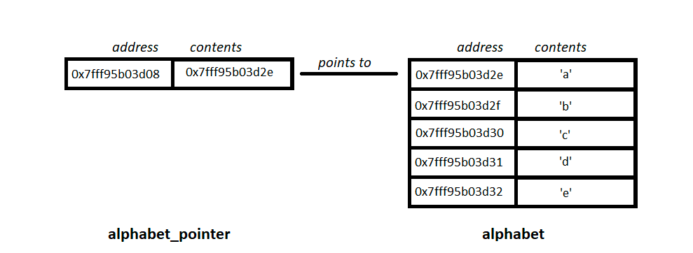 
  
  - ### Structures 
    - Known as "Records" or "Data Classes" 
      - also called as "structs", sometimes referred to as "classes" and "objects"
    - A way to represent a "structured data" in memory
      - meaning it has a standard format of mixed "types" representing a cohesive "thing" (sometimes called "shape" or "form")
    - The "structure" can represent anything
      - like a person, a car, a house, a company, a country, a planet, a solar system
      - Keep in mind, it's just a representation, not an actual thing and can only track the representative data
      - The classic GI-GO (Garbage In, Garbage Out) problem
    - The "structure" is usually made up of a list of "fields" which are the individual pieces of data that make up the "structure"
    - The "fields" are usually accessed by a "name" which is a human-readable label for the "field"
    - The "fields" are usually stored in a contiguous block of memory
    - The "fields" are usually different types (like numbers, letters, strings, dates, times, arrays, and other Records)
    
    - Example of a "Person" structure (C)
      ```C
        struct Person {
            char name[32];  // 32 characters to represent the name
            int age;        // 4 bytes to represent the age
            float height;   // 4 bytes to represent the height
            float weight;   // 4 bytes to represent the weight
        };
      ```
  
  - ### Stack
    - A way to represent a "last in, first out" list of things in memory, similar to a stack of dinner plates
    - The "things" are usually all the same size & type
    - The "things" are usually all stored in a contiguous block of memory
    - The "things" are usually accessed by a "stack pointer" which is a number that represents the position of the top-most "thing" in the stack
    - Efficient for adding and removing items from the list, but not efficient for accessing items in the list
      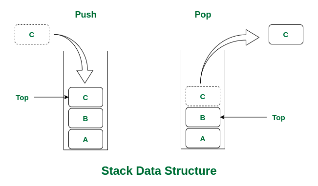  

  - ### Queue
    - A way to represent a "first in, first out" list of things in memory, similar to a line of people waiting for a bus
    - The "things" are usually all the same size & type
    - The "things" are usually all stored in a contiguous block of memory
    - The "things" are usually accessed by a "head" and "tail" which are numbers that represent the position of the first and last "thing" in the queue
    - Efficient for adding and removing items from the list, but not efficient for accessing items in the list
      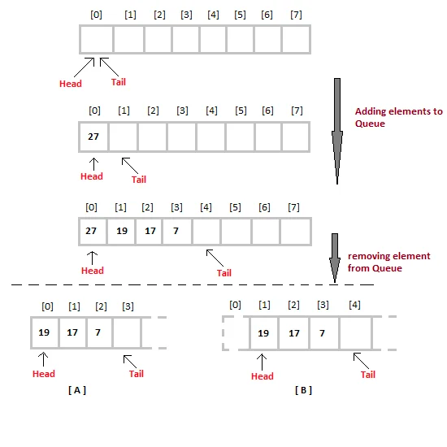
  
  - ### Linked List
    - A way to represent a "list" of things in memory, where each "thing" points ONLY to the next "thing" in the list
    - The "things" are usually all the same size & type
    - The "things" are NOT stored in a contiguous block of memory, which is the main difference between an array and a linked list
    - The "things" are usually accessed by a "pointer" which is a number that represents the location of the "thing" in memory
    - Used to represent a "dynamic" list, where the size of the list is not known ahead of time
    - Efficient for adding and removing items from the list, but not efficient for accessing items in the list
      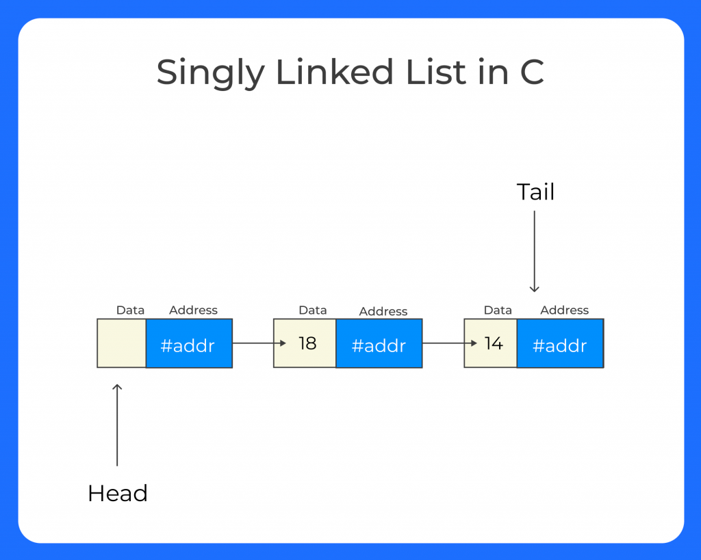

  - ### Tree
    - A way to represent a "hierarchical" list of things in memory, where each "thing" points to one or MORE "things" in the list
    - The "things" are usually all the same size & type
    - The "things" are NOT stored in a contiguous block of memory, which is the main difference between an array and a tree
    - The "things" are usually accessed by a "pointer" which is a number that represents the location of the "thing" in memory
    - Used to represent a "hierarchical" list, like a family tree, or a company organization chart
    - Special Case of a tree is a "Binary Tree" where each "thing" points to only two "things" in the list
      - Binary Trees are used to represent "sorted" lists, where each "thing" is greater than the "thing" to the left, and less than the "thing" to the right
      
        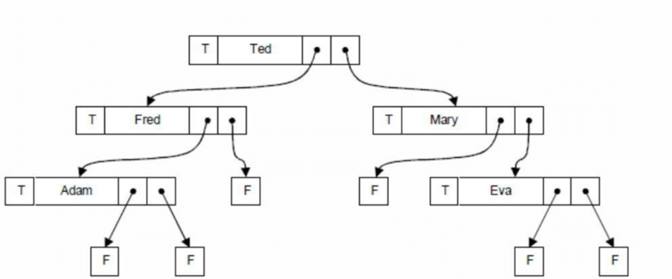

# High-Level Language Styles

- ## Procedural Programming 1950s-Present (for amateurs, 1960s-1990s for professionals)
   - First style of high-level language after assembly language
   - Considered "high level" because it was abstracted from the assembly language. The language was actually just 
     another program that translated the "high level" language into "machine code" for the CPU, usually at runtime.
   - Procedural code is executed top to bottom, one line at a time. Control flow is done with "IF" and "GOTO" statements
   - GOTO was still commonly used, as most people didn't know how to use "subroutines" or "functions" yet and 
   - GOTO was easier to understand, at least first.
   
   - Example of Procedural-Oriented Programming with GOTO's: BASIC (Beginner's All-purpose Symbolic Instruction Code)
     ```BASIC
     5 REM PROGRAM TO ADD 2 NUMBERS, PRINT RESULT <-- "REM" is a "remark" or "comment"
     10 LET X = 10   <-- "LET" is a "statement" that assigns a value to a variable
     20 LET Y = 32
     30 GOTO 100     <-- "GOTO" is a "statement" that changes the next line to execute to a different line
     40 PRINT "Output: "; Z
     50 GOTO 150
     60 IF X = 10 THEN GOTO 190
     70 GOTO 10
     100 REM ADD 2 NUMBERS, RESULT IN Z  
     110 LET Z = X + Y   <-- All variables are global and mutable
     120 GOTO 40
     150 PRINT "THIS GOTO STUFF CAN GET CONFUSING"
     160 GOTO 60
     190 PRINT "HOW DID I GET HERE?"
     220 END
   
     RUN
     
     Output: 
     42
     THIS GOTO STUFF CAN GET CONFUSING
     HOW DID I GET HERE?
     
     ```
 
   - ### The Painful Push for Subroutines & Some Structure
     - Programmers were eventually forced into using "subroutines" to deal with extreme overuse of "JUMP/GOTO" 
       statements common to programming at that time which lead to extremely confusing, unreadable and unmaintainable 
       "spaghetti code", so named because of the way the "GOTO" statements would jump around the program and get mixed
       up like a plate of spaghetti.
     - These subroutines are referred to "functions," "procedures," and "methods" in modern programming languages.
     - The "subroutines" are usually called and returned using a "stack" to keep track of where the program left off, 
       instead of having to use "GOTO" statements
     - Variables were usually "global" and "mutable" which lead to "side effects" and hard to understand "state" of the program
     - Each program was very "linear," "sequential," "imperative," and not portable or reusable, which lead to a lot of waste
     - Data and Code were kept separate.
       - Code was loaded into the computer, and then data was separately loaded and processed in "batches"
     - Example of Procedural BASIC with Subroutines and `GOSUB`'s (the `GOSUB` command is a `GOTO` a "SUBroutine"):
       ```BASIC
       10 LET X = 10
       20 LET Y = 32
       30 GOSUB 100
       40 PRINT "Output 1: "; Z
       50 LET X = 110
       70 GOSUB 100
       80 PRINT "Output 2: "; Z
       100 REM ADD 2 NUMBERS, RETURN IN Z  <-- This start of a "subroutine", REM is a "remark" or "comment" and is ignored by the program
       110 LET Z = X + Y 
       120 RETURN  <-- end of a "subroutine", return execution to the line after the "GOSUB" statement
     
       RUN
     
       Output 1: 42
       Output 2: 142
     
       ```
     
   - ### Loops instead of GOTOs
     - The FOR "loop" statement was introduced to replace the "GOTO" statement, as an attempt to make procedural 
       code more "structured."
     - The "loop" statement was used to repeat a block of code a certain number of times, or until a certain condition was met.
   
     - Example in BASIC:
       ```BASIC
       10 FOR A = 1 TO 10 STEP 1 <-- The "FOR" statement changes the value of "I" from 1 to 10, incrementing by 1 at each NEXT statement
       15 GOSUB 100
       20 PRINT A, B
       30 NEXT A   <-- Execution continues at line after the "FOR" statement (15), unless "I" is 10, then it goes to next line (40) 
       40 END
       100 REM ADD A AND B, RETURN IN B
       110 LET B = A + B
       120 RETURN
     
       RUN
     
       Output:
          1 1
          2 3
          3 6
          4 10
          5 15
          6 21
          7 28
          8 36
          9 45
          10 55
       ```
 
   - Examples of Procedural languages are "Fortran" and "BASIC" and "COBOL"
 
 - ## Structured Programming 1960s-Present
   - No more "goto" statements, only subroutines and conditional branching were allowed
   - The concept of "scopes" (or "code blocks") to limit the use of "globally mutable" variables
     - This is the origin of "encapsulation" and first introduced to limit the visibility of the "local" variables 
       and functions to only the "scope" or "block" that they were defined in, and to limit the "side effects" of the program.
     - By reducing the area that needs to be understood, it makes the program easier to understand and maintain and
       allowed for larger teams to work on the same program without stepping on each other's toes. 
     - This is also the reason for the "Structured Programming" paradigm, as it was the first time that the "state"
       of the program was "structured" and "encapsulated" into "scopes" or "code blocks"
     - Example of structured language (C): 
       - Note: The `//` symbols means the rest of the line is comment, it is not part of the program, 
             it's just for explanation and is ignored by the compiler.
       ```C
       int main() {  // <-- start of the program, `int` means the function returns an integer 
         int y = 100;
         int x = 10; 
         { // <-- start of a "scope" or "code block" or just "block"
           int y = 32; // local to the "scope"
           x = x + y; 
         } // <-- end of the "scope"
         
         printf("%d", x); // <-- print the value of x as a decimal number
         printf("%c", x); // <-- print the value of x as a character (the ASCII value of x)
       }
       
       main();  // <-- call the "main" function, runs the program
       
       // Output: 
       // 42
       // *
       ```
     - Live Code Example in Kotlin: [Structured Programming Example](src/main/kotlin/structuredExample.kt)
   
   ### Types
   - The concept of "types" (or "kinds") was introduced to define the size & intended purpose of "primitive" 
     data types 
     - Primitive types are: `int`, `long`, `float`, `char`, and `bool`
     - Primitive types are the "building blocks" of all other types defined in `struct`s
     - Example (C):
       ```C
       struct Point {  // <-- `Point` is a programmer-defined type that is made up of other types
          int x;
          int y;
          char colorIdChar;  // <-- `char` is a type that represents a single ASCII character (1 byte)
       };
       
       int main() { 
          int x = 5; 
          float y = 6.128; 
          char z = 'A'; 
          struct Point p = { 10, 42, 'G' };
          
          printf("Output: %d %f %c   %d   %d  %c", 
                          x, y, z, p.x, p.y, p.colorIdChar);
       }
       
       main();
       
       // Output: 5 6.128000 A 10   42   G
        
       ```
     - Live Code Example in Kotlin: [Types Example](src/main/kotlin/typesExample.kt)
   
   - This allowed more code reuse and easier to understand "state" of the program than procedural languages
   - This allowed libraries and "modules" to be easily produced to create standard "subroutines" and
     "data structures" into "packages" and "system utilities" and "frameworks" to be used by other programmers
     - Started the concept of "published interfaces" that could be imported into another program and used to 
       provide the functionality of the "library." 
     - These libraries were collections of functions and data structures that were related to each other for a specific task.
   - Structure languages were also much more portable and reusable than procedural languages as they were not
     tied to any specific computer hardware or operating system. The computer manufacturer only had to create the 
     compiler for their particular machine, and then the same code could be run on any machine that had a compiler 
     for the language.

- ## Class Oriented Programming (COP) 1970s-Present
  - Usually misnamed "Object Oriented Programming," as "Objects" are _not_ the main focus, "Classes" are!
  
  - Collected ideas around: 
    - ### Encapsulation 
      - Data & code are "encapsulated," (or enclosed) into a `class` (
        - also called a "Template", it is similar to a blueprint for a house as it describes what will be created when the house is built)
      - A `class` is a template for creating an in-memory instance of the class (called an "Object") which contains the 
        state and pointers to the "methods" (functions) of the `class`
      - When a new Object is created from a class template, the Object is called an "instance" of the class.
      - An Object is just a structure in memory that contains the values (or "state") of the variables and pointers to 
        the methods of the class
      - A "Method" is just a normal function in the class that manipulates the variables in the object, 
        or call other methods in the object or other objects
        - The process of calling a method on an object is referred to as "sending a message" to the object 
        - (THIS IS TERRIBLE WORDING! bc it's not a message! It's just calling a function!!!! THIS IS NOT MESSAGING! AAAAHH!)
      - The values of the variables ("state") of the object are often made inaccessible from outside the class (ie: "private") 
        and only accessible by the methods of the class, or the methods in the inherited subclasses of the class.
      - Methods of the class can be made `public` to be globally accessible by other classes to provide the functionality of the class.
      - Some methods of the `class` can be labeled `protected` and only accessible by subclasses of the class
      - There is a special modifier called `static` makes a variable or method accessible without needing an instance of the class (object)
        - This loophole is the main reason why I call it "Class Oriented Programming" is not "object" oriented programming!
        - It's a way to make the class act like a "namespace" to group together the "methods" and "variables" that are related to each other
        - This was not the original intent of the "class" and "object" paradigm, but was a way to fit the COP 
          paradigm into the "procedural" paradigm.
      - The use of the word "constructor" is a bit of a misnomer, as the memory space for the Object has been allocated 
        and the `constructor` is called to set the initial values of the variables in the object ("initialize" the state.)
    
    - ### Classes and Objects as Static "Name Spaces" for Procedural-Style Code Implementations
      - In COP languages, the `class` is used as a "namespace" to group together various methods and variables that 
        are related to each other (known as "high cohesion") into a single class.
      - All code must be inside an object OR be declared as a `static` member of a class to be accessible without an object
      
      - #### Issues with Static Methods and Attributes
      - This often lead to "collections of static methods" that simply extended the "procedural" paradigm, except the
        code blocks now had a name (the name of the Class) and were grouped together instead of being globally accessible.
      - The `static` methods were passed in data as parameters and returned data as a result, just like the "procedural" paradigm.
        - When `static` is used this way, it completely breaks encapsulation. The objects are just bags to hold code, 
        and the data is fully exposed to anyone who wants to access it, as it is not retained as state within the object.
      - This `static` way of programming lead to the same exact problems as the "procedural" paradigm, but with the 
        added complexity of the "class" and "object" paradigm.
      - These were popularized by web frameworks such as Java's Spring Boot and Many Others
        - The Pain of OOP, Lecture #2: Static methods and attributes are evil
        - https://www.youtube.com/watch?v=lELJSj9mWbI
      - One of the main problems is that `static` methods and data lead to issues with "testing" the code, as the 
        `static` methods and data are not "stateful" and are not "encapsulated" in the object, so they are not 
        easily "mocked" or "stubbed" for testing purposes.
      - Another side-effect of `static` methods and data is that they are not "thread-safe" and can lead to 
        data corruption
      - And the largest issue is that `static` is shared mutable state and is the root of all evil in programming as it
        leads to "side effects" and tough to understand "state" of the program which leads to unnecessary complexity and bugs.
      - What's Wrong About Utility Classes? (webinar #6)
        https://www.youtube.com/watch?v=psrp3TtaYYI
    
    - ### Interfaces
        - An `interface` is an agreement or "contract" that the class will have certain defined methods & variables in the class.
        - It's a way to tell the compiler AND the programmer that the class must have certain "methods" and "variables" in it to be considered a valid "subclass" of the interface
        - The `interface` is implemented by the `subclass`, where the methods and variables are defined by the "concrete implementing" `class`
            - Example (in pseudo-code similar to common COP languages):
              ```OOP Pseduo-Code
              interface Document {     // <-- interfaces only define the "signature" of the methods it expects to be in the subclass
                expects method view()  // this interface expects a method called "view" 
              }  
            
              // PDF is one "concrete implementing" class of the "Document" interface
              class PDF implements Document { // PDF is a subclass of Document, and must implement the "view" method
                  override method view() { // <-- the implementation of the interface (uses the "override" keyword) 
                     print "Launch PDF Viewer"  
                  } 
              }
              
              // Email is one "concrete implementing" class of the "Document" interface
              class Email implements Document { // Email is a subclass of Document, and must implement the "view" method
                  override method view() { // <-- the implementation of the interface (uses the "override" keyword)
                     print "Launch Email App"  
                  } 
              }
              
              // Song is one "concrete implementing" class of the "Document" interface
              class Song implements Document { // <-- the implementation of the interface (uses the "override" keyword)
                  override method view() { 
                     print "Launch Music Player"  
                  } 
              }
              
              // Start of program
              method main() {
                  Document doc1 = new PDF()
                  Email doc2 = new Email()  
                  Song doc3 = new Song() 
                 
                  function viewDocument(Document doc) {  // Note that the parameter is of type `Document` and not `PDF` or `Email` or `Song` 
                      doc.view() // Will call the appropriate "view" method of the subclass
                  }
                  
                  viewDocument(doc1)  // <-- will print "Launch PDF Viewer"
                  viewDocument(doc2)  // <-- will print "Launch Email App"
                  viewDocument(doc3)  // <-- will print "Launch Music Player"
              }
              ```
              Live Code Example: [How Interfaces Work in Kotlin](src/main/kotlin/interfaceExample.kt)
        - Interfaces allow a developer to add multiple different implementations of the same named method by defining a 
          new `class` that `implement`s the superclass `interface` by defining code for the methods in the subclass
            - This makes it easier to add new subclasses of the `interface` to the program without changing any existing code
            - This also make it easier to write "testing" code that can be used to automatically verify the correctness of the methods
              of the `class` by using "testing" implementations of the `interface`
        - The `interface` is `implement`ed by a `class` and the methods are finished by the implementing `subclass` 
          according to the method signatures in the `interface`
        - "Subclassing" is also called "Subtyping" or "Inheritance" and is the basis for "Polymorphism" and "Dynamic Binding"

    - ### Inheritance 
      - Inheritance is the idea that a new `class` can inherit from another `class` all of its methods and variables,
        and then add new methods or override methods in the subclass that will modify the behavior of the 
        original `class`
      - Classes can inherit from other classes to reuse code and "state", and to create "subtypes/subclasses"
      - The class that is inherited from is called the "superclass" and the class that inherits is called the "subclass"
      - The "subclass" is also called a "derived class" and the "superclass" is also called a "base class"
      - Example:
      - ```OOP pseudo-code
        open class Media {   // <-- the "base class" or "superclass", `open` means it can be subclasses (extended/inherited)
          // Note: there is no visible constructor, so the default constructor will be used -> Media(), which takes no parameters and does not initialize any variables.
          
          open method play() { 
            print "Playing: " + this.name 
          } 
        }  
        
        open class MP3 extends Media {   // <-- the "subclass" or "derived class"; it `extends` (inherits) from the superclass (Media).
            // NOTICE: No constructor is defined, so the default constructor in the superclass will be used -> Media()
        
            override method play() { 
               print "Playing MP3: " + this.name 
            } 
        }
        
        class Video extends Media { 
            // NOTICE: No constructor is defined, so the default constructor in the superclass will be used -> Media()
            
            override method play() { 
               print "Playing Video: " + this.name 
            } 
        }
        
        class ProtectedMP3 extends MP3 {  // note: "Concrete Class" MP3 must be declared as `open` in order to be subclassed
            String password
            Boolean authenticated = false
        
            constructor ProtectedMP3(String name, String password) {  // <-- the constructor of this class, its called to initialize the object
                super(name)  // <-- calls the constructor of the superclass (MP3)
                this.password = password    // Sets the password for the password protected MP3
            }
        
            method authenticate(String password) {
                if (this.password == password) {
                    this.authenticated = true
                    print "Authenticated!"
                }
            } 
            override method play() {
               if (this.authenticated == true) {
                    print "Playing Protected MP3: " + this.name 
               } else {
                    print "Not Authenticated!"
               }
            } 
        }
        
        // Start of program
        method main() {
            Media doc0        = new Media()  // Since the `Media` class is `open` and not `abstract`, an object can be created from it.
            Media doc1        = new MP3()
            Media doc2        = new Video()
            ProtectedMP3 doc3 = new ProtectedMP3("MyProtectedMP3.mp3", "MySecretPassword123")  // note that the `ProtectedMP3` type is required to call the `authenticate` method

            function playMedia(Media media) {  // Note that the parameter is of type `Media` and not `MP3` or `Video` or `ProtectedMP3`
                media.play()
            }
        
            playMedia(doc0)            // <-- will print "Playing: MyMedia"
            playMedia(doc)             // <-- will print "Playing MP3: MyMP3.mp3"
            playMedia(doc2)            // <-- will print "Playing Video: MyVideo.mp4"
        
            playMedia(doc3)            // <-- will print "Not Authenticated!"
            doc3.authenticate("MySecretPassword123")  // <-- will print "Authenticated!"
            playMedia(doc3)            // <-- will print "Playing Protected MP3: MyProtectedMP3.mp3"
        }
        
        // Output:
        // Playing: MyMedia
        // Playing MP3: MyMP3.mp3
        // Playing Video: MyVideo.mp4
        // Not Authenticated!
        // Authenticated!
        // Playing Protected MP3: MyProtectedMP3.mp3
        ```
        - Live Code Example: [How Inheritance Works in Kotlin](src/main/kotlin/inheritanceExample.kt)
    
    - ### Abstract Classes
      - Very similar to interfaces but can have default implementations of the methods & include variables
      - The `abstract class` is usually `extend`ed by the subclass and then the methods are overridden by the subclass
      - Example:
        - ```OOP pseudo-code
          abstract class Document1 { 
            String name = ""                  // <-- Abstract classes can have variables.
        
            Document1(String name) {           // <-- Abstract classes can have "default" constructors.
                this.name = name
            }
            expects method view()          // Expects a method called "view" and has no default implementation.
            expects method showName() {    // Expects a method called "showName" and has a default implementation.
                print "Document Name: " + this.name // <-- The "default implementation" for any subclass that doesn't override the method.
            } 
          }  
        
          class PDF1 extends Document1 {  // <-- PDF1 is a subclass of Document1.
              override method view() { // <-- the implementation of the abstract class "view".
                 print "View PDF: " + this.name  
              } 
          }
        
          class Email1 extends Document1 { // <-- Email1 is a subclass of Document1.
              String to
              String from
              String subject
      
              Email1(String to, String from, String subject) {  // <-- the custom constructor of this class, its called to 
                                                                //     initialize the variables of the object.
                  super("Email to:" + to)  // <-- calls the constructor of the superclass (Document1).
                  this.to = to
                  this.from = from
                  this.subject = subject
              }
          
              override method view() {  // <-- the implementation of the abstract class "view".
                 super.showName(to)     // <-- Calls the "default implementation" of the abstract superclass.
                                        // Note: Calls to the super class are not required, but can be used to call any 
                                        // implementations of the superclass.
             
                 print "View Email: from= " + this.from + ", to= " + this.to + ", subject= " + this.subject 
              }
              override method showName() { // <-- overrides the "default implementation" of the abstract superclass.
                 super.showName()    // <-- calls the "default implementation" of the abstract superclass. 
                                     // note: What `name` represents depends on the context!
              } 
          }
        
          class Song1 extends Document { // <-- Song is a subclass of Document
              override method view() {  // <-- the implementation of the abstract class "view"
                   print "Listen to Music Player: " + this.name
              } 
          }
        
          // Start of program
          method main() {
              // Document1 doc0 = new Document("MyDocument1")  // Since the `Document1` class is `abstract`, an object cannot be created from it. 
                                                             // This will cause a compiler error.
              Document1 doc1 = new PDF("MyPDF1.pdf")
              Song1     doc2 = new Song("MySong1.mp3")
              Email1    doc3 = new Email(to="Chris", from="Bob", subject="Meeting")
        
              function viewDocument(Document doc) {  // Note that the parameter `doc` is of type `Document` and not `PDF` or `Email` or `Song`.
                  doc.view(name)
              }
        
              viewDocument(doc1)  // <-- will call the "view" method of the PDF1 class
              viewDocument(doc2)  // <-- will call the "view" method of the Song1 class 
              viewDocument(doc3)  // <-- will call the "view" method of the Email1 class
          }
      
          // Output:
          // View PD1: MyPDF1.pdf
          // Listen to Music Player: MySong1.mp3
          // Document Name: Email to:Chris
          // View Email: from= Bob, to= Chris, subject= Meeting
      
        ```
        - Live Code Example: [How Abstract Classes Work in Kotlin](src/main/kotlin/abstractClassExample.kt)

    - ### Polymorphism
      - Polymorphism is the idea that a method can be called on an object and the method will behave differently
        based on the "type" of the "object" that the "method" is called on
        - This is the basis for overriding methods in subclasses and `interfaces` and `abstract class`es
        - In the example above, the `viewDocument` function can be called with any `Document` object and the `view` method
          will behave differently based on the "type" of the `Document` object that is passed in
 
    - ### Controlled Mutability and Visibility of Variables
      - Use of explicit `private` and `protected` and `public` to control the visibility of the variables and methods 
        of the class
      - Encouraged to use getters and setters to control the access to the variables of the class (which has since 
        been shown to be a bad idea due to misuse and overuse of the pattern)
    
    - ### Issues from Abuse of Inheritance and Allowing for "Multiple Inheritance" in C++ 
      - Lead to immense & unnecessary complexity to fit in the "simulation" paradigm, as programmers tried to shove the 
        "Procedural Paradigm" into the fancy new "Class Oriented" paradigm with less than stellar results.
      - Inheritance is a usually a bad idea for many reasons, and very overused beyond its original intent.
        - The hype around reusability was so strong that it was often used to justify the use of inheritance in places 
          where it was not appropriate.
        - This lead to "fragile" and "rigid" code that was hard to understand and hard to modify, leading to a lot 
          of waste and costs.
        - Many popular ways of dealing with the "procedural approach" to COP were turned into "design patterns" 
          that were used to "fix" the problems of the "procedural approach" to COP. Many of these ideas were just
          hacks to fit the "procedural approach" into the "COP" paradigm. 
        - The promise of "reusability" was not fulfilled by COP languages.
      - Banana, Monkey, Jungle Problem
        - https://crystal-villanueva.medium.com/the-banana-and-the-gorilla-problem-92c9a4717fd6
      - Java's Creators Rejected Multiple Inheritance - Here's Why
        - https://www.youtube.com/watch?v=1-JBFJ8Xar0
      - If you really want to achieve multiple inheritance (you should not need to, but here's how to do it):
        - https://www.youtube.com/watch?v=3X9Eo2vzY1I
        - Live Code Example: [How to Achieve Multiple Inheritance in Kotlin](src/main/kotlin/multipleInheritanceExample.kt)

    - Examples of Class Oriented Programming languages are "Simula," "C++" and "Java"
 
 - ## Back-to Object Oriented Programming 1980s-Present
   - Alan Kay Style BOOP (Back-to-Object Oriented Programming)
     - Based on the idea of "messaging" between objects, VERY poorly named "object oriented programming" (admitted by Alan Kay)
   
   - What's Wrong With Object-Oriented Programming?
     - https://www.youtube.com/watch?v=K_QEOtYVQ7A
   - All state is fully retained in the "object" and "methods" are used to send & receive messages to the "object" to 
     change its "state"
   - Any state that needs to be exposed is only via "messages" to the object, and the object can choose to respond to 
     the message or not.
   - No `static` methods or variables, only instance variables that are private to the object.
   - `protected` methods are allowed, but discouraged as they lead to "fragile" and "rigid" code.
   - Use of inheritance is explicitly discouraged, and prefer composition over inheritance. Exceptions for shallow
     hierarchies of 2-3 levels maximum meant to model the real world objects, not to create a "hierarchy of types."
   - Use of interfaces is limited to Classes that require testing, and are not automatically added for every class.
   - Use of `setters` and `getters` is specifically disallowed. Instead, the object is expected to respond to messages to change its 
     state, and to respond to messages to get its state.
   - Specific COP patterns are *NOT* permitted, such as:
     - Factory Pattern
     - Use of `null`
     - Getters and Setters
     - Reflection & Type Casting
     - Inheritance
     - Mutable State - All state in BOOP is immutable, and the object is expected to return a new object with the new state.
   - Amazingly, the dreaded Singleton Pattern is allowed to manage global state in BOOP.
   
   - Back-to Object Oriented Programming Example (Kotlin):
   - ```Kotlin
     class Page(  // <-- the "Page" class constructor, the "val" keyword means the variable is immutable.
        private val content: String
     ) {
       fun view() {
          println("Page: $content")
       }
       
       fun updateContent(newContent: String): Page {
          return Page(newContent)  // <-- the "updateContent" method is expected to return a new object with the new state.
       }
       
       fun inspectContent(): String {
          return content
       }
     }

     class Book(
        val title: String,
        private val pages: List<Page>
     ) {
        fun view() {
           println("Book: $title, # of Pages: ${pages.size}")
           pages.forEach { it.view() }
        }

	    fun updateTitle(newTitle: String): Book {
		   return Book(newTitle, pages)  // <-- The "updateTitle" method returns a new object with the new state.
	    }

	    fun updatePages(newPages: List<Page>): Book {
		    return Book(title, newPages)  // <-- The "updatePages" method returns a new object with the new state.
	    }
     }

     class Application(
        private val book: Book  // <-- The "Application" class, the "val" keyword means the variable is immutable.
     ) {
        fun view() {
           println("Application Viewing: ${book.title}")
           book.view()
        }

        fun updateBook(newBook: Book): Application {
		   return Application(newBook)  // <-- The "updateBook" method returns a new object with the new state.
	    }
     }
     
     // Start of Program
     fun main() {
        // Create the list of Page objects
        val pages = listOf(  // <-- the "val" keyword means the variable is immutable and can only be assigned once.
           Page("Page 1 Content"),
           Page("Page 2 Content"),
           Page("Page 3 Content")
        )
        // Create the book object using the list page objects
        val book = Book(
           "MyDocument.txt",
           pages
        )
        // Create the application object using the book object 
        var app = Application(book) // <-- The "var" keyword means the variable is mutable,
                                    //     `app` is a "var" because it's expected to change state.
                                    // Every other variable is a "val" and is immutable.

        // The above code could be arranged in the functional style, where the state of the program is created in 
        // a single line!
        // This style is also known as "declarative" style, as opposed to the familiar "imperative" style.
        // Using declaritive style, the code is more about "what" is being done, rather than "how" it's being done.
        // You only see the high-level view, and the implementation details are hidden deeper in the code.
	    app = Application(
	    	Book(
	    	   title = "MyDocument.txt",
	    	   pages = listOf(
	    	      Page("Page 1 Content"),
	    	      Page("Page 2 Content"),
	    	      Page("Page 3 Content")
	    	   )
	    	)
	    )

	    app.view()  // <-- will print:
	                // Application Viewing: MyBook.txt
	                // Book: MyBook.txt, # of Pages: 3
	                // Page: Page 1 Content
	                // Page: Page 2 Content
	                // Page: Page 3 Content
	                // app.book = Book("NewBook.txt")  // <-- will not compile, as the variable `book` is immutable and cannot be changed.
        
	    // To change the state of the application, a whole new object must be created with the new state,
	    // usually based on a copy the old state, with modifications to reflect the new state.
	    val newPages = pages
	    	.filter { page ->  // instead of using imperative "for" loops, "filter" internally uses a loop to create
	    		// a new list of pages.
	    		page.inspectContent() != "Page 2 Content" // <-- removes the 2nd page from the list.
	    	}
	    	.toMutableList()  // <-- converts the immutable list to a mutable list to allow for adding a new page.
	    	.apply { // <-- creates a new list of pages with the same content as the original list.
	    		add(  // <-- adds a new page to the list.
	    			Page("New Page 4 Content")
	    		)
	    	}
	    	.toList()  // <-- converts the mutable list back to an immutable list.
	    
        // The `updateBook` method is called to update the `book` which will create a `app` with the new state.
        app = app.updateBook(
           app.book // <-- Using the `book` from the current state of the application to copy the state of the `book`.
              .updateTitle("UpdatedBook.txt") // <-- Creates a new book with the updated name and the same `pages`.
              .updatePages(newPages)  // <-- Creates a new book with the updated `pages` and the same `title`.
        )
        
	    app.view()  // <-- will print:
	                // Application Viewing: UpdatedBook.txt
	                // Book: UpdatedBook.txt, # of Pages: 3
	                // Page: Page 1 Content
	                // Page: Page 3 Content
	                // Page: New Page 4 Content
     }
     
     main()

     // Output:
     // Application Viewing: MyDocument.txt
     // Book: MyDocument.txt, # of Pages: 3
     // Page: Page 1 Content
     // Page: Page 2 Content
     // Page: Page 3 Content
     // Application Viewing: UpdatedBook.txt
     // Book: UpdatedBook.txt, # of Pages: 3
     // Page: Page 1 Content
     // Page: Page 3 Content
     // Page: New Page 4 Content
     
     ```
   - Live Code Example: [BOOP example](src/main/kotlin/boopExample.kt)   
   - There are only a few BOOP languages, "Smalltalk" and, _incredibly_, "Javascript" are among the most popular ones.
 
 - ## Functional Programming 1950s-Present
   - ### Main Idea: Immutability & No Side Effects
     - Functional Programming's main idea is to avoid "side effects" and "shared mutable state" of the program.
     - One way is to is to make the state of the program unchangeable. Changes can only be made by creating a new state 
       based on the a copy of the old state, and then returning the new state as the result of a function.
     - BOOP style is a form of "Functional Programming" as the state of the program is immutable and passed as arguments 
       to the functions, and a new state is returned as the result of the calls to the functions.
   - All functions in the core of the application return a value and have no "side effects" on any other "state" of 
     the program.
   - It's more of a style of programming than a "paradigm" as it can be used in any language, but it's most effective 
     in languages that are designed to be "functional" from the ground up.
   - The reason for this is that the "state" of the program is "immutable" and passed as arguments to the functions, 
     and a new state is returned as the result of the calls to the functions.
   - This makes the program easier to understand and maintain, and allows for "parallel" and "concurrent" programming 
     to be done more easily.
   - It also eliminates whole classes of bugs that are caused by "side effects" and "shared mutable state" of the program.
   - The state of the program is immutable and passed as arguments to the functions
   - A new state is returned as the result of the calls to the functions
   - Functions are "first-class citizens" and can be passed as arguments to other functions, just like normal variables and objects
     - This allows customization of the functions by passing in any function as an argument to another function
     - This allows the functions to be "composed" together to create new functions from existing functions
     - These functions are called "lambdas," "closures," "anonymous functions" or "function literals," 
       and "higher-order functions" all interchangeably. It's all just functions!
   - Examples of functional languages are "Lisp", "Clojure" and "Javascript" and "Kotlin"
   - Example (Kotlin):
       ```Kotlin
       fun main() {
          val add = { a: Int, b: Int -> a + b }  // <-- a lambda that takes 2 integers and returns the sum of the integers.
          val multiply = { a: Int, b: Int -> a * b }  // <-- a lambda that takes 2 integers and returns the product of the integers.
          val firstThenSecond = {  // <-- a lambda that takes 4 arguments, 2 functions and 2 integers, and returns the result of the 2 functions. 
              first: (Int, Int) -> Int, // <-- a lambda that takes 2 integers and returns an integer, it's executed first.
              second: (Int, Int) -> Int,  // <-- a lambda that takes 2 integers and returns an integer, it's executed second.
              a: Int, 
              b: Int -> 
                 second(first(a, b), b)  // <-- calls the `first` lambda with the 2 integers (a & b), 
                                         //     then calls the `second` lambda with the result of `first()` and the 2nd integer (b)
          }              
          
          val result = firstThenSecond(add, multiply, 10, 2) // <-- calls the lambda with the 2 functions and 2 integers 
          println(result) // result will be 24
       }
       
       main()
         
       // Output:
       // 24

   - Live Code Example: [Functional Example](src/main/kotlin/functionalExample.kt) 

- ## Threads & Coroutines
  - Threads are a way to run multiple "processes" at the same time, and are used to create "parallel" and "concurrent" programs.
  - Coroutines are a way to run multiple "processes" at the same time, and are used to create "parallel" and "concurrent" programs.
    - Coroutines always run inside one or more threads, and are used to create "parallel" and "concurrent" programs.
  - Threads are relatively resource-heavy, as each thread requires its own "stack" and "heap" to run, and can be 
    difficult to manage and debug when there are many threads running at the same time and sharing mutable state.
  - Coroutines are relatively resource-light and simplify the management of where parts of the program are running.
  - Coroutines are built-in to the Kotlin language, and are a first class citizen. Use of coroutines is built-into 
     the standard libraries and leveraged by the language itself.
  
    - Example Threads in Kotlin:
      ```
      fun main() {
          var x = 0
    
          val thread1 = Thread {
              for (i in 1..10) {
                  println("Thread 1: $i, x=$x")
                  x++
                  Thread.sleep(1000)
              }
          }
          val thread2 = Thread {
              for (i in 1..10) {
                  println("Thread 2: $i, x=$x")
                  x++
                  Thread.sleep(1000)
              }
          }
          thread1.start()
          thread2.start()
          thread1.join()
          thread2.join()
      }
    
      main()
    
      // Output:
        // Thread 1: 1, x=0
        // Thread 2: 1, x=0
        // Thread 1: 2, x=1
        // Thread 1: 3, x=3  // <-- The threads are running at the same time, so the output is likely not in order.
        // Thread 2: 2, x=2
        // Thread 2: 3, x=4
        // Thread 1: 4, x=5
        // Thread 2: 4, x=6
        // Thread 2: 5, x=8
        // Thread 1: 5, x=7
        // Thread 1: 6, x=9
        // Thread 2: 6, x=10
        // Thread 1: 7, x=11
        // Thread 2: 7, x=12
        // Thread 1: 8, x=13
        // Thread 2: 8, x=14
        // Thread 1: 9, x=15
        // Thread 2: 9, x=16
        // Thread 1: 10, x=17
        // Thread 2: 10, x=18  // <-- 
      
    - Live Code Example: [How Threads Work in Kotlin](src/main/kotlin/threadExample.kt)

  - Example Coroutines in Kotlin:
  - ```Kotlin
    import kotlinx.coroutines.*
    
    fun main() {
        var x = 0
        val job1 = GlobalScope.launch {
            for (i in 1..10) {
                println("Coroutine 1: $i")
                delay(1000)
            }
        }
        val job2 = GlobalScope.launch {
            for (i in 1..10) {
                println("Coroutine 2: $i")
                delay(1000)
            }
        }
        runBlocking {
            job1.join()
            job2.join()
        }
    }
    
    main()
    
    // Output:
    
    ```
  - Live Code Example: [How Coroutines Work in Kotlin](src/main/kotlin/coroutineExample.kt)
- ## Conclusion
  - The "paradigms" are not "better" or "worse" than each other, they are just different ways to structure the 
    "state" and "behavior" of the program.
  - The "paradigms" are not "mutually exclusive," and can be used together to create a program that is easier to 
    understand and maintain.
  - The "paradigms" are not "static," and are constantly evolving as new ideas are added to the "paradigms" to 
    make them more effective and easier to use.
  - The "paradigms" are not "perfect," and have their own "trade-offs" and "costs" that must be considered when 
    choosing which "paradigm" to use for a particular program.
  - The "paradigms" are not "dogma," and should not be followed blindly, but should be used as a guide to help 
    structure the "state" and "behavior" of the program.
  - The "paradigms" are not "one-size-fits-all," and should be chosen based on the "requirements" of the program 
    and the "experience" of the programmer.
  - The "paradigms" are not "independent," and are often used together to create a program that is easier to 
    understand and maintain.
  - The "paradigms" are not "static," and are constantly evolving as new ideas are added to the "paradigms" to 
    make them more effective and easier to use.
  - The "paradigms" are not "perfect," and have their own "trade-offs" and "costs" that must be considered when 
    choosing which "paradigm" to use for a particular program.
  - The "paradigms" are not "dogma," and should not be followed blindly, but should be used as a guide to help 
    structure the "state" and "behavior" of the program.
  - The "paradigms" are not "one-size-fits-all," and should be chosen based on the "requirements" of the program 
    and the "experience" of the programmer.
  - The "paradigms" are not "independent," and are often used together to create a program that is easier
   


