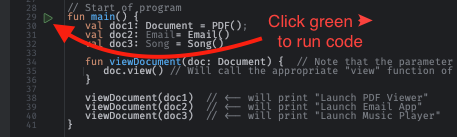

# How to Program From The Bottom Up (with Minimal BS)
©2024 Chris Athanas

A guide for the beginner software engineer who needs a primer overview of software development as a semi-historical
walk through the essential part of computing to create effective software.

This is not a thorough deep dive into any one topic, but a broad overview of the essential concepts and principles
that seems to be missing from most programming tutorials and courses. My goal is to give you the context about
why things are the way they are in computing, and how they came to be that way, and the issues and problems that
arose from the way things are.

I have found that it's far more imporatnt to understand the process that people went through to create the
current solutions than to understand the mechanical details of how the solution work. Many detail about
disadvantages and limitations is often left out of the discussion, or worse, simply not known or dismissed as
irrelevant due to ignorance.

The guide is a reference and follow along guide for my video series on YouTube: 
 - [YouTube Series - How to Program From The Bottom Up (with Minimal BS)](https://www.youtube.com/playlist?list=PLzUxWOrVXB4QHsURai1GmmhmqAUVNbfno)

## Table of Contents
- [Introduction](#introduction)
- [The Essence of Computing](02-TheEssentialQuestion-WhatAreWeComputing.md)
- [Hardware](03-Hardware.md)
  - Using Natural Phenomenon to Represent Human Information
    - [The Wire & the Light Bulb & the Battery](03-Hardware.md#the-wire--the-battery)
    - [The Simple Switch](03-Hardware.md#the-simple-switch)
    - [The Magnificent Magnet](03-Hardware.md#the-magnificent-electromagnet)
    - [The Raucous Relay](03-Hardware.md#the-raucous-relay)
    - [The Voracious Vacuum Tube](03-Hardware.md#the-voracious-vacuum-tube)
    - [The Tiny Transistor](03-Hardware.md#the-tiny-transistor)
    - [The Interchangeable Integrated Chip (IC)](03-Hardware.md#the-interchangeable-integrated-chip-ic)
      - [Why are NAND gates so special?](03-Hardware.md#nand-gates) 
    - [The Mighty Microprocessor](03-Hardware.md#the-mighty-microprocessor)
- [Data Structures](04-DataStructures.md)
  - How Humans Represent Data in Binary in Computers?
  - [Numbers](04-DataStructures.md#numbers) 
  - [Characters](04-DataStructures.md#characters)
  - ["Data Structures"](04-DataStructures.md#data-structures)
  - [Array](04-DataStructures.md#array)
  - [String](04-DataStructures.md#string)
  - [Pointer](04-DataStructures.md#pointer)
  - [Stack](04-DataStructures.md#stack)
  - [Queue](04-DataStructures.md#queue)
  - [Linked List](04-DataStructures.md#linked-list)
  - [Map](04-DataStructures.md#map)
  - [Tree](04-DataStructures.md#tree)
- [Software](05-Software.md)
  - How to Represent Human Problems in a Digital Computer?
  - [Machine Code](05-Software.md#machine-code)
  - [Representation of Data in Computer Memory](05-Software.md#representation-of-data)
    - [Binary Counting](05-Software.md#binary-counting)
    - [Hexadecimal Counting](05-Software.md#hexadecimal-counting)
    - [Standardized ASCII](05-Software.md#standardized-ascii)
  - [The Minimum Components of a Computer System](05-Software.md#minimum-components)
    - [The CPU/MPU](05-Software.md#the-cpu-mpu)
    - [The Clock](05-Software.md#the-clock)
    - [Program Counter](05-Software.md#program-counter)
    - [Common Machine Language Opcodes](05-Software.md#common-opcodes)
    - [Fetch-Decode-Execute Cycle of the CPU](05-Software.md#fetch-decode-execute-cycle)
    - [Registers](05-Software.md#registers)
    - [Arithmetic Logic Unit (ALU)](05-Software.md#alu)
    - [Control Unit](05-Software.md#control-unit)
  - [Assembly Language](05-Software.md#assembly-language)
    - [Common Assembly Language Operations](05-Software.md#common-assembly-operations)
    - [Variables](05-Software.md#variables)
    - [Subroutines](05-Software.md#subroutines)
- [High-Level Languages](06-HighLevelLanguages.md#high-level-languages)
  - How can we make programming easier and more understandable for humans?
  - [Programming Styles](06-HighLevelLanguages.md#programming-styles)
  - [Procedural Programming](06-HighLevelLanguages.md#procedural-programming)
    - [Problem: Abusing GOTO](06-HighLevelLanguages.md#abusing-goto)
    - [Solution: Subroutines](06-HighLevelLanguages.md#solution-subroutines)
    - [Problem: Naive Solutions](06-HighLevelLanguages.md#naive-solutions)
    - [Problem: Imperative Looping](06-HighLevelLanguages.md#problem-imperative-looping)
    - [Solution: Declaritive Looping](06-HighLevelLanguages.md#solution-declarative-for-loop)
- [Software Design](07-SoftwareDesign.md)
  - How can we organize and communicate the solution to a problem in a way that is understandable?
  - [Algorithms](07-SoftwareDesign.md#algorithms)
  - [Time Complexity](07-SoftwareDesign.md#time-complexity)
    - [Shorthand Guide & Sample Code](07-SoftwareDesign.md#time-complexity-example)
  - [Communicating Software Designs Visually](07-SoftwareDesign.md#communicating-software-designs)
  - [Some Thoughts on Common Software Production Methodologies](07-SoftwareDesign.md#some-thoughts-on-common-software-production-methodologies)
- [Structured Programming](08-StructuredProgramming.md)
  - Can we give some kind of standard way of organizing and communicating the solution to a problem? 
  - [Scopes](08-StructuredProgramming.md#scopes)
  - [Types](08-StructuredProgramming.md#types)
- [Class Oriented Programming](09-ClassOrientedProgramming.md)
  - Can we simulate real-world objects easier than with procedural or structured programming?
  - [COP Tried to Introduce a New Style of Programming, But Ended With Mixed Results](09-ClassOrientedProgramming.md#cop-tried-to-introduce)
  - [Encapsulation](09-ClassOrientedProgramming.md#encapsulation)
    - [Simplistic Overview of a Class and an Object Instance of the Class](09-ClassOrientedProgramming.md#simplistic-overview)
    - [Sophisticated Diagram of a Class and Object Instance](09-ClassOrientedProgramming.md#sophisticated-diagram)
    - [Instantiation or "Allocating Memory" for an Object of a Certain Class](09-ClassOrientedProgramming.md#instantiation)
    - [Object Instance Variable Values = "State" of the Object](09-ClassOrientedProgramming.md#object-instance-variable-values)
    - [Problem: Using Classes and Objects as "Name-Spaces/Scopes" Lead to Procedural-Style Code Implementations](09-ClassOrientedProgramming.md#using-classes-and-objects-as-name-spaces)
    - [Problems Arising from Abusing Static Methods and Attributes](09-ClassOrientedProgramming.md#problems-arising-from-abusing-static)
  - [Interfaces](09-ClassOrientedProgramming.md#interfaces)
  - [Inheritance](09-ClassOrientedProgramming.md#inheritance)
    - [Problems Arising from the Abuse of Inheritance](09-ClassOrientedProgramming.md#problems-arising-from-the-abuse-of-inheritance)
  - [Abstract Classes](09-ClassOrientedProgramming.md#abstract-classes)
  - [Polymorphism](09-ClassOrientedProgramming.md#polymorphism)
  - [Controlled Visibility of Variables and Methods](09-ClassOrientedProgramming.md#controlled-visibility)
  - [Allowing for "Multiple Inheritance" in C++ was a mistake, and it was removed from Java and C# for very good reasons](09-ClassOrientedProgramming.md#multiple-inheritance-removed)
  - [Design Patterns](09-ClassOrientedProgramming.md#design-patterns)
- [Back-to-Object Oriented Programming](10-BackToObjectOrientedProgramming.md)
  - Can we re-visit the original principles of OOP to make softare easier to understand and maintain?
  - [Banned Patterns in BOOP](10-BackToObjectOrientedProgramming.md#banned-patterns-in-boop)
  - [Why is Class-Oriented Programming (COP)](10-BackToObjectOrientedProgramming.md#why-is-cop-bad)
  - [Back-to Object Oriented Programming Example](10-BackToObjectOrientedProgramming.md#boop-example)
- [Functional Programming](11-FunctionalProgramming.md)
  - Can we structure our code in a way to have less bugs and be easier to understand?
  - [Immutability & No Side Effects](11-FunctionalProgramming.md#immutability-no-side-effects)
  - [Functional Programming Style](11-FunctionalProgramming.md#functionalExample)
- [Parallel Processing (also called "Concurrent" Programming)](12-ParallelProcessing.md)
  - Can we make our programs run faster by doing more than one thing at a time?  
  - [Threads](12-ParallelProcessing.md#threads)
  - [Fixing the threads "race condition" problem using "Atomic" updates](12-ParallelProcessing.md#atomic-updates)
  - [Coroutines](12-ParallelProcessing.md#coroutines)
  - [Fixing the Coroutine race condition problem using "Atomic" updates](12-ParallelProcessing.md#fixing-updates-with-coroutines)
  - [Coroutines are Much Faster Than Threads](12-ParallelProcessing.md#coroutines-vs-threads)

## Introduction
  - How to guide for budding software engineers who need a primer overview of software development concepts 
    from the fundamentals of physical logic representation to high-level programming languages.
  - ### The goal is to have you
  - understand more the `why` and `how` of programming, not just the `what` and `where`.
    - This is my curated list of information to take you on a realistic and grounded journey of understanding
      the essential part of computing to create effective software.
    - There will be some technical details, but only enough to understand the fundamental principles, not to be an expert.
    - I cover the areas that I had difficulty understanding when I was learning to program.
    - This is more-or-less a historical walk through `WHY` things are the way they are in computing, and `HOW` they came to be that way.
  
  > I have since discovered that the majority of my confusion derived from how things were presented to me. 
  > Instructors often completely misunderstood correct application and limits of metaphors and lacked real-world 
  > experience of the things they were teaching. Many just repeated what they were taught without understanding.
  > When challenged about their knowledge, they would often become defensive and dismissive, and sometimes even hostile.
    
  > Many of the concepts are, in retrospect, full of needless jargon and unnecessary complexity. I now understand that
  > the complexity was often used to make the instructor seem more knowledgeable and to make the subject seem more
  > difficult than it actually is.
      
  > I would like to say at the outset that there is a TREMENDOUS number of technical-sounding words with all
  > referring to the same basic core ideas. I will do my best to be as consistent as possible, and also work to 
  > point out the multiple definitions and reduce the jargon and clarify the core meanings and ideas.

## The Essence of Computing
  - People used to do all computing by hand, and now we use various machines to do the same thing, 
    in a much faster and more reliable way.
    - When we use a machine to do computing, we are just using the machine to represent the problem and the 
      solution in a different way.
    - The machine knows nothing about the problem. it's only following orders created by clever humans using 
      boolean logic to represent the problem and its sequence of actions to solve it.
    - Each operation in the computer was once done by teams of people working in groups, logically delineated in 
      nearly the same way as the computer's components are arranged.
        - There were specialized roles for each person, for example, the "storage" would be a set of filing cabinets 
          and a clerk to store and retrieve them.
          - This is now done by the "hard drive" and the "file system" in the computer.
        - The arithmetic would be done by a person called a "calculator" who would perform the operations and record the results.
          - This is now done by the "Arithmetic Logic Unit" and stored in the "Registers" in the computer.

    ## SOME IMPORTANT ITEMS TO KEEP IN MIND
    - THERE IS NO MAGIC IN COMPUTING, ONLY _HUMAN_ CLEVERNESS, _HUMAN_ SYSTEMIC THINKING AND _HUMAN_ INGENUITY 
      USED TO SOLVE _HUMAN_ PROBLEMS. 
      - If you hear anyone say _"it's magic"_ or _"it's a black box"_ or _"it's kind of like a person,"_ 
        they are: 
        1) Being lazy, 
        2) Or indicating it's not relevant at the moment,
        3) Or (USUALLY) they don't understand the problem or the solution enough to explain it and become hand-wavy.
    
    - ### ITS ALWAYS JUST _HUMAN_ CLEVERNESS AND INGENUITY, THE IDEA OF REPRESENTING ONE THING AS ANOTHER, NOTHING MORE.
      
      - The machines CAN _NEVER_ UNDERSTAND the problem or the solution in the way humans conceive of the problem.
      - These machines are only following the logical operations that humans have carefully designed to represent 
        the problem and a solution "space." There is no inherent "understanding" in the machine, and can never be.
      - The only way the machine would ever know the full human context of the problem (and the solution) is if 
        the machine ACTUALLY was a human, and then it would be a _human_, and not a machine. 
      - Mistaking the machine for having intelligence is known as "The Eliza Effect" and is a common mistake 
        made by people who don't understand the limits of the machine's capabilities.

## How to Install and Run the Samples in this Guide
  - [Install IntelliJ IDEA Community Edition](https://www.jetbrains.com/idea/download/)
  - [How to clone this Project from Github to your local machine](https://www.jetbrains.com/guide/java/tips/clone-project-from-github/#:~:text=Clone%20a%20project%20from%20the%20IntelliJ%20IDEA%20welcome%20screen&text=Click%20Get%20from%20VCS%2C%20specify,into%20an%20IntelliJ%20IDEA%20project.)
  - Navigate to this `README.md` file in the project and click on the links to the sample code.
  - In the left hand gutter, click on the green arrow to run the sample code.
    
    

- [Continue Reading - The Essential Question](02-TheEssentialQuestion-WhatAreWeComputing.md)
- [Back to Index](README.md)

