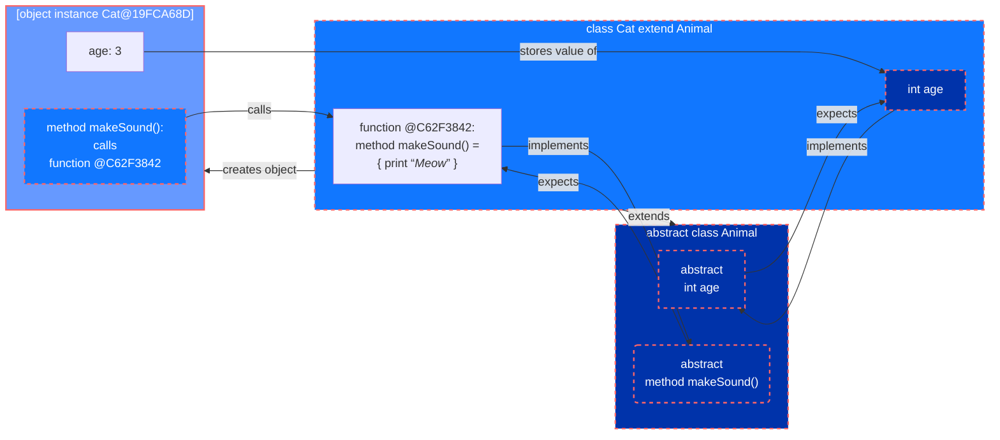

```mermaid
     flowchart LR

    catMakeSoundFunctionPointer -- calls --> catMakeSound
    subgraph catObject["[object instance Cat@19FCA68D]"]
        catAgeData["`age: 3`"] 
        catMakeSoundFunctionPointer["`method makeSound(): 
                                       calls 
                                       function @C62F3842`"]
    end
    catAgeData -- stores value of --> catAgeInt
    
    catAbstractAgeInt -- expects --> catAgeInt
    abstractMethodMakeSound -- expects --> catMakeSound
    catAgeInt -- implements --> catAbstractAgeInt
    subgraph classCat["class Cat extend Animal"]
        catAgeInt["int age"]
        catMakeSound["`function @C62F3842:
                    method makeSound() =
                    {  print “_Meow_” }`"]
    end

    classCat -- creates object --> catObject
    classCat -- extends --> abstractAnimal
    catMakeSound -- implements --> abstractMethodMakeSound
%%    dogMakeSound -- implements --> abstractMethodMakeSound
%%    abstractAnimal -- expects --> classDog
    subgraph abstractAnimal["abstract class Animal"]
      catAbstractAgeInt["`abstract 
                          int age`"]
      abstractMethodMakeSound("`abstract 
                                method makeSound()`")
    end

%%      classDog -- creates object --> dogObject
%%      subgraph classDog[actual class Dog]
%%         dogMakeSound["`[function @28FCA68D]
%%                        method makeSound(): 
%%                        { return _Woof_ }`"]
%%      end

%%      dogMakeSoundFunctionPointer -- calls --> dogMakeSound
%%      subgraph dogObject["[Object Dog@78FDB7A9]"]
%%          dogMakeSoundFunctionPointer["`method makeSound(): 
%%                            calls Function @28FCA68D`"] 
%%          
%%      end  

     style abstractAnimal fill:#03A, stroke:#f66, stroke-width:2px, color:#fff, stroke-dasharray: 5 5
     style abstractMethodMakeSound fill:#03A, stroke:#f66, stroke-width:2px, color:#fff, stroke-dasharray: 5 5
     style catAbstractAgeInt fill:#03A, stroke:#f66, stroke-width:2px, color:#fff, stroke-dasharray: 5 5
     
     style classCat fill:#17F, stroke:#f66, stroke-width:2px, color:#fff, stroke-dasharray: 5 5
     style catAgeInt fill:#03A, stroke:#f66, stroke-width:2px, color:#fff, stroke-dasharray: 5 5
     
     style catMakeSoundFunctionPointer fill:#17F, stroke:#f66, stroke-width:2px, color:#fff, stroke-dasharray: 5 5
     
     %%style classDog fill:#17F, stroke:#f66, stroke-width:2px, color:#fff, stroke-dasharray: 5 5
%%     style classDog fill:#17F, stroke:#f66, stroke-width:2px, color:#fff, stroke-dasharray: 5 5
     style catObject fill:#69F, stroke:#f66, stroke-width:2px, color:#fff
%%     style dogObject fill:#69F, stroke:#f66, stroke-width:2px, color:#fff, stroke-dasharray: 5 5
     style catMakeSoundFunctionPointer stroke-dasharray: 5 5, stroke:#f66, stroke-width:2px
     style catAbstractAgeInt stroke-dasharray: 5 5, stroke:#f66, stroke-width:2px
     style catAgeInt stroke-dasharray: 5 5, stroke:#f66, stroke-width:2px
```