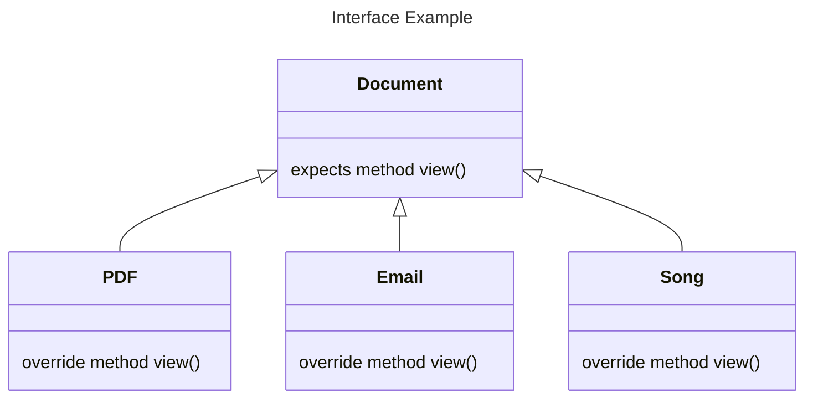
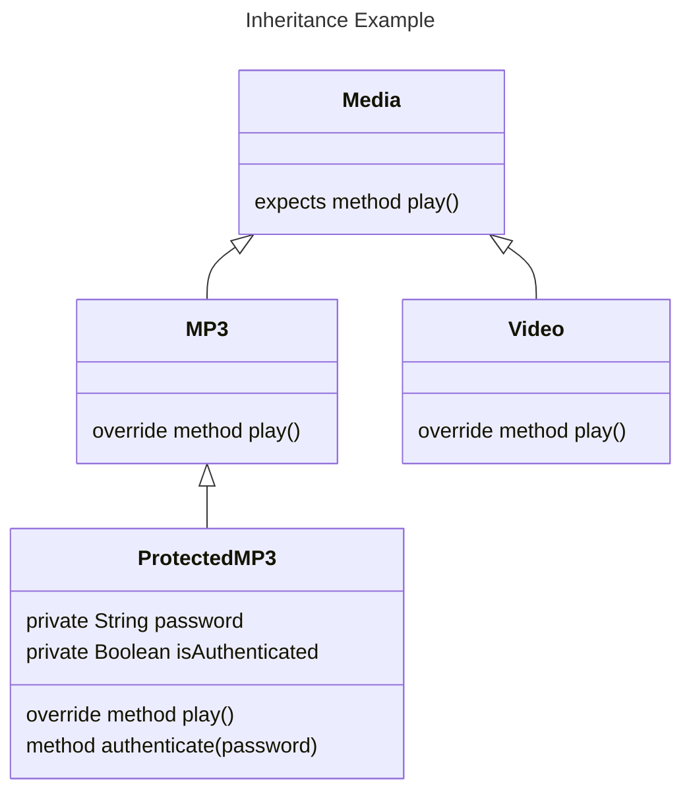

# Test

```mermaid
---
title: Interface Example

---
classDiagram
Document <|-- PDF
Document <|-- Email
Document <|-- Song
Document: expects method view()

class PDF{
	override method view()
}
class Email{
	override method view()
}
class Song{
	override method view()
}
```

```mermaid
---
title: Inheritance Example

---
classDiagram
Media <|-- MP3
Media <|-- Video
MP3 <|-- ProtectedMP3
Media: expects method play()

class MP3{
    override method play()
}
class Video{
    override method play()
}
class ProtectedMP3 {
    private String password
    private Boolean isAuthenticated
    
    override method play()
    method authenticate(password)
}
```