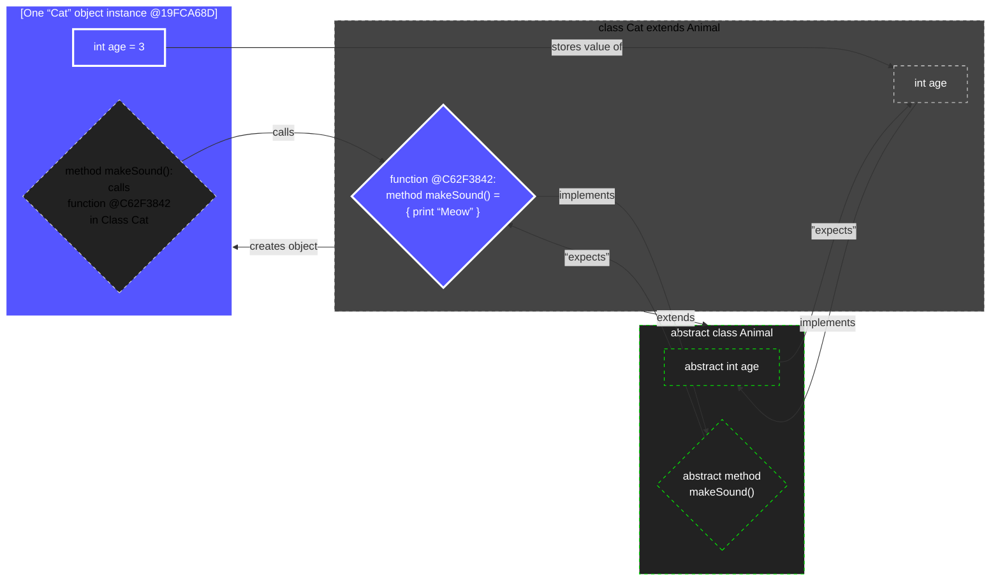

```mermaid
    flowchart LR

    catObjectMakeSoundMethodFunctionPointer -- calls --> catClassMakeSoundMethod:::Object
    catObjectAgeInt -- stores value of --> catClassAgeInt
    subgraph catObject["[One “Cat” object instance @19FCA68D]"]
        catObjectAgeInt["int age = 3"]
        catObjectMakeSoundMethodFunctionPointer{"method makeSound(): 
                                           calls 
                                     function @C62F3842
                                     in Class Cat"}
    end
    
    abstractAgeInt -- ”expects” --> catClassAgeInt
    abstractMakeSoundMethod -- “expects” --> catClassMakeSoundMethod:::Object
    catClassAgeInt -- implements --> abstractAgeInt:::Abstract
    subgraph classCat["class Cat extends Animal"]
        catClassAgeInt["int age"]
        catClassMakeSoundMethod{"function @C62F3842:  
                    method makeSound() =
                    { print “Meow” }"}
    end

    classCat -- creates object --> catObject:::Object
    classCat -- extends --> abstractAnimal:::Abstract
    catClassMakeSoundMethod -- implements --> abstractMakeSoundMethod:::Abstract
    subgraph abstractAnimal["abstract class Animal"]
      abstractAgeInt["abstract int age"]
      abstractMakeSoundMethod{"abstract method 
                               makeSound()"}
    end

    classDef Abstract fill:#222, stroke:#0F0, stroke-width:1px, color:#fff, stroke-dasharray: 5 5
    
    classDef Class fill:#444, stroke:#00F, stroke-width:1px, color:#000, stroke-dasharray: 5 5
    style classCat fill:#444, stroke:#DDD, stroke-width:1px, color:#000, stroke-dasharray: 5 5
    style catClassAgeInt fill:#444, stroke:#DDD, stroke-width:1px, color:#FFF, stroke-dasharray: 5 5
        
    classDef Object fill:#55F, stroke:#FFF, stroke-width:3px, color:#fff
    style catObjectAgeInt fill:#55F, stroke:#FFF, stroke-width:3px, color:#fff
    style catObjectMakeSoundMethodFunctionPointer fill:#222, stroke:#DDD, stroke-width:1px, color:#000, stroke-dasharray: 5 5
```